# **業務データを活用したAIチャットシステム ワークショップ**

OpenAIによって開発された大規模な言語モデルGPTを活用すると、テキスト生成/自然言語理解/文章の翻訳などのさまざまなタスクをこなすことができます。これらを業務に活用することで、これまで負荷のかかっていた作業を省力化できる可能性があるため、大きく注目されています。

たとえば、業務ナレッジ/設計書/技術文書/製品メンテナンス情報がPDF/PowerPoint/Excelファイルでばらばらに管理されている企業は多いのではないでしょうか？これらの中には非常に有用な情報であるにもかかわらず、社内で十分に有効活用されていない、また必要な情報にたどり着くまでに時間がかかり生産性の低下をおこしたりコミュニケーションコストの増大をおこしていることもあります。

例えば、<span style="font-weight: bold; color: steelblue;"> 「私は水素ハイブリット電車の設計者です。〇〇の設計上の注意点は何ですか？」</span>   と自然言語で専門用語や業務固有のナレッジについて問い合わせると、GPTが適切なクエリを生成して必要な情報を検索します。その検索結果をさらに集約して、質問者の問いに対するピンポイントな回答や要約ができれば、<span style="font-weight: bold; color: steelblue;"> 「〇〇さんに聞かなければわからない貴重なノウハウ」「どこにあるか分からない情報を捜すのに苦労している」</span>など現場の多くの課題を解決できます。


このシステムを社内導入するためには、GPTなどAIそのものの知識に加えて、AIを組み込んだWebアプリケーションをどう実装するか？や、セキュリティを担保しつつどう運用管理するか？などの幅広い知識が求められます。

---

このワークショップでは、 <span style="font-weight: bold; color: steelblue;"> 研究論文の内容もとに適切な回答を作成するチャットシステム</span> の作成を通して、Azure OpenAI Service やAzure Cognitive Searchなどの使い方やチャットシステムを社内に展開するためのWebアプリケーションの作成やAPI基盤の整備などの基礎を学びます。

このワークショップの特徴は次の3つです。

- **国内リージョンを利用できる**

Azureの環境を東日本リージョン(japaneast)に構築できます


- **専門用語や業界独自のナレッジを検索できる**

ChatGPT(gpt-35-turbo)モデルでトレーニングされたデータに基づいてテキストを生成するのではなく、企業内に閉じたデータをもとに生成します

- **回答の根拠を明確にする**

ChatGPTの回答に「引用」をテキストに付加することで、より信頼できる応答を生成します


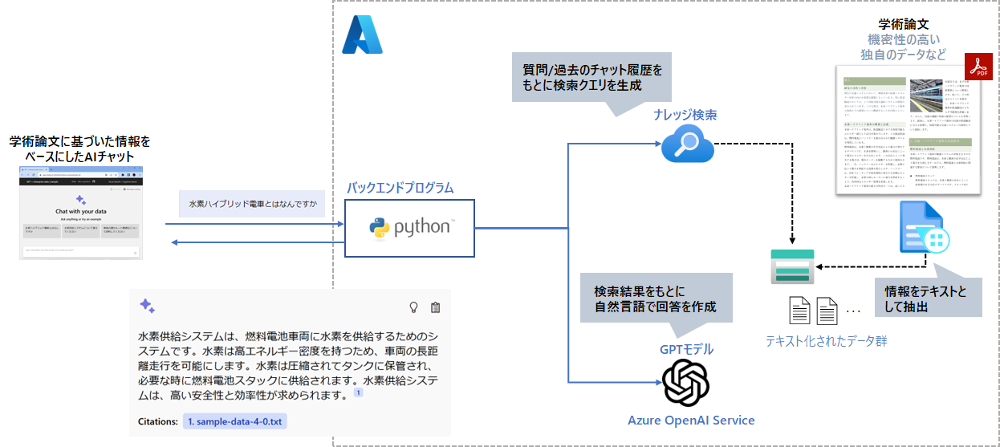


このワークショップは、AI技術に興味のあるデータサイエンティスト、エンジニア、研究者、または企業内での情報アクセスやナレッジ共有の改善を目指す方々に適しています。

本ワークショップで作成したAPIは、WebアプリだけでなくモバイルアプリケーションやPowerAppsなどのローコードアプリケーションからも利用できます。


## 🔧事前準備

ワークショップを始める前に、お使いの開発マシンに次の環境を準備します。
* [Visual Studio Codeのインストール](https://code.visualstudio.com/download)
* [Dockerのインストール](https://www.docker.com/get-started)
* [GitHubアカウントの作成](https://github.co.jp/)

!> このワークショップを実行するには、 **Azure OpenAI Service へのアクセスを有効にした** Azure サブスクリプションが必要です。アクセスは[こちら](https://aka.ms/oaiapply)からリクエストできます。またワークショップで使用するAzureアカウントには、アクセス管理者や所有者(`Microsoft.Authorization/roleAssignments/write`)のアクセス権限が必要です。


本ワークショップの受講者は、基本的なAzureの知識とAzure ポータルでの操作経験を前提としています。またGitHubの操作経験と基本的なプログラミング知識が必要となります。

---
# **Part1: Azure環境構築と検索データ作成** 

このパートでは、ワークショップをおこなう上で必要なAzure環境を構築します。


ワークショップでは、ダミー論文をサンプルデータとして利用します。実際の業務データを使いたい場合は、各自データを用意してください。ただし、インターネットに公開しても問題のないデータを使用してください。


?> このワークショップで使用されているPDF文書には、Azure OpenAI Serviceを使用して生成された情報が含まれています。これらのドキュメントに含まれる情報は、デモを目的としたものであり、マイクロソフトの意見や信条を反映したものではありません。マイクロソフトは、明示または黙示を問わず、このドキュメントに含まれる情報の完全性、正確性、信頼性、適合性、可用性について、いかなる種類の表明または保証も行いません。すべての権利はマイクロソフトに帰属します。


#### このパートのゴール
* Azure Developer CLIを活用したAzure環境の構築や管理の流れを知る


## 💻ハンズオン
### 1. サンプルアプリケーションの準備


まず、ブラウザを開きご自身のアカウントでGitHubにアクセスします。そして、[こちら](https://github.com/asashiho/azure-search-openai-demo)のサンプルコードを自分のリポジトリにForkします。


次に、Visual Studio Codeを起動します。 **[表示]-[拡張機能]** を選び、検索で **「Dev Containers」** を選び、この拡張機能を **[インストール]** をします。これはコンテナ環境で開発環境を動かすための拡張機能です。


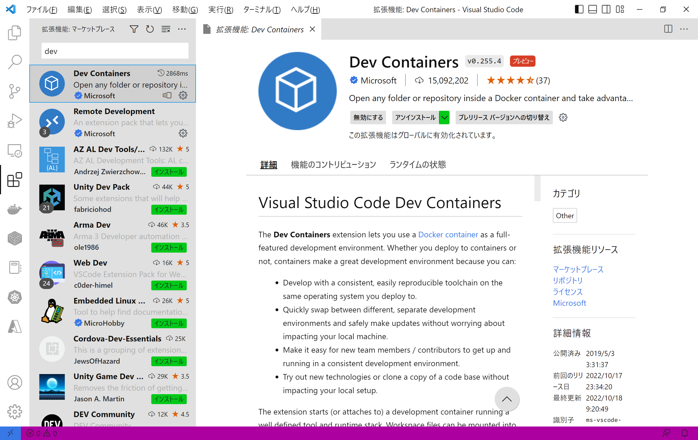


ターミナルから次のコマンドを実行してForkしたリポジトリをクローンします。

```bash
git clone https://github.com/<Your_GitHub_Name>/azure-search-openai-demo
```


次に **[ファイル]-[フォルダを開く]** を選び クローンした **「`azure-search-openai-demo`」** フォルダを開いてください。

!>もし異なるフォルダを開いている場合、本ワークショップで必要な環境がセットアップされませんので、注意してください。


サンプルフォルダを開いたら、Visual Studio Codeの左下の[`><`]アイコンをクリックして「`Reopen in Container`」を選びます。

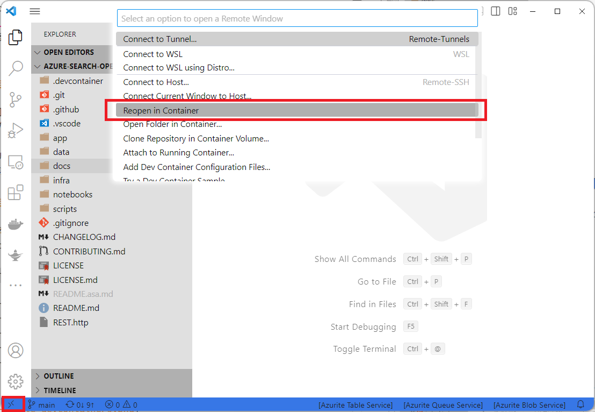

ターミナルを確認すると、今回のワークショップで使用するライブラリ群がインストールされているのがわかります。

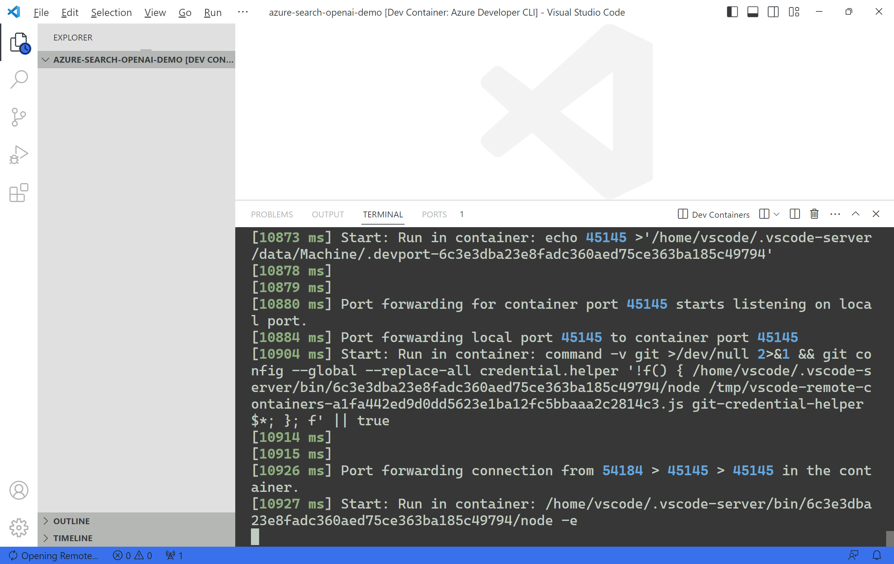

数分するとインストールが完了します。完了すると[`>< Dev Container: Azure Developer CLI`]となり、次のようなターミナル(コマンドを実行する箇所)が表示されます。これは、開発に必要な環境一式がDockerコンテナとして起動できるVisual Studio CodeのDevContainersという機能を使っています。もしエラー等で起動できない場合は、Visual Studio Codeを再起動しローカルPCでDockerコンテナが動作しているかを確認してください。


これで開発の準備ができました。


?>**コンテナを活用した開発環境の構築**<br>
アプリケーションを開発するときに、まず行うべきことは開発環境の作成です。言語ランタイムやライブラリをデバッグやテストに必要なツール群をインストール・設定する必要があります。
Visual Studio CodeのRemote-Containers 拡張機能を使用すると、開発環境をDockerコンテナで動かすことができます。
コンテナ内に開発環境を閉じ込めることができるため、ランタイムバージョンの異なる環境・開発言語が異なる環境もコンテナを切り替えるだけで利用できます。
また、標準化した環境を作成するためのDockerfileを作っておけば、大規模プロジェクトで複数の開発するメンバーが参画するときも、コンテナイメージを共有すればよいだけので、統一された環境をつかって開発を始めることができます。<br>
 公式ドキュメント:「[Developing inside a Container](https://code.visualstudio.com/docs/remote/containers)」


### 2. Azure環境の作成
本ワークショップではAzureの環境作成とサンプルアプリのデプロイにAzure Developer CLIを利用します。

Azure Developer CLI(azdコマンド)は、Azureのリソースを管理するためのオープンソースのコマンドラインツールです。Azure Developer CLIを使用することで、Azure上のリソースの作成、更新、削除などを行うことができます。またAzure Developer CLIは、Azureのリソースを管理するためのスクリプトを作成する際にも役立ちます。Azure Developer CLIを使用することで、Azure上のリソースをプログラムから操作することができ、IaCによる自動デプロイや管理ができます。また、テンプレートが用意されているのでこれをもとに環境を素早く作成できます。このテンプレートは自作することも可能で、プロジェクトの要件にあわせたものを作成して開発チームで展開できます。


ターミナルに次のコマンドを入力してAzureにログインします。そしてAzure OpenAIが利用可能なAzureサブスクリプションを設定します。

例えば、サブスクリプションIDが「`aaaaaaaa-bbbb-cccc-dddddddddddd`」の場合、次のコマンドを実行します。

```bash
azd auth login

azd config set defaults.subscription aaaaaaaa-bbbb-cccc-dddddddddddd
```


!>必ずAzure OpenAIが利用可能なサブスクリプションを指定してください。

本ワークショップで使用するAzure環境はAzure Developer CLIで構築します。Visual Studio Codeのターミナルで次のコマンドを実行します。

はじめに [`azd init`](https://learn.microsoft.com/en-us/azure/developer/azure-developer-cli/reference#azd-init)コマンドで環境の設定を行います。

```bash
azd init
```

環境名を聞かれるので「`aoai-workshop`」と入力します。

```bash
Enter a new environment name: [? for help] (azure-search-openai-demo-csharp-dev) aoai-workshop
```

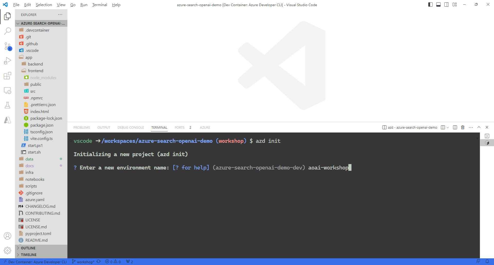

このコマンドを実行すると「`.azure`」ディレクトリが作成され、環境構築に必要な設定ファイルが格納されます。

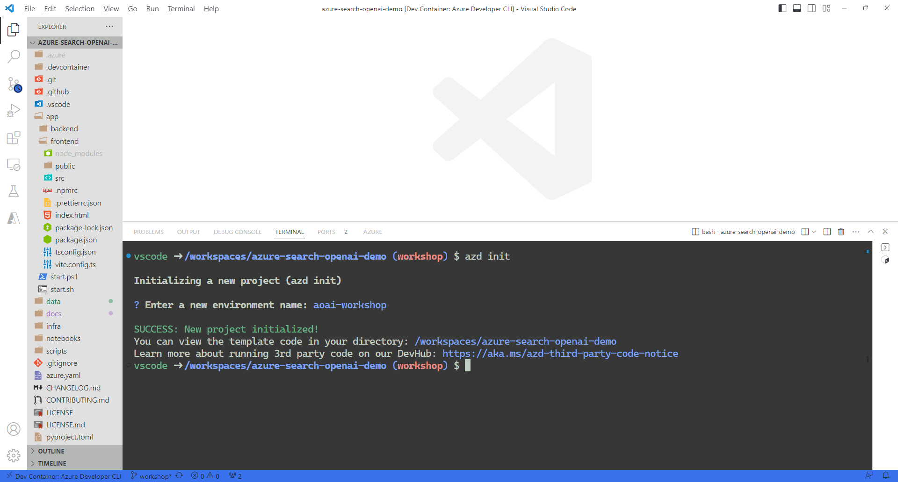


次に[`azd up`](https://learn.microsoft.com/en-us/azure/developer/azure-developer-cli/reference#azd-up)コマンドを実行し、Azure リソースをプロビジョニングして、サンプルアプリをデプロイします。

```
azd up
```

コマンドを実行すると、Azureのサブスクリプションを聞かれるので、Azure OpenAIが利用可能なサブスクリプションを選びます。

```bash
? Select an Azure Subscription to use:  [Use arrows to move, type to filter]
```


コマンドを実行すると次の値を聞かれるので、自身の環境にあわせて入力します。

|      項目       |                                                                                                        設定内容                                                                                                         |                設定例                |
| --------------- | ----------------------------------------------------------------------------------------------------------------------------------------------------------------------------------------------------------------------- | ------------------------------------ |
| location        | Azure OpenAI Serviceの「`gpt-35-turbo (0613)`」「`text-embedding-ada-002(Version 2)`」モデルが利用可能な[リージョン](https://learn.microsoft.com/ja-jp/azure/cognitive-services/openai/concepts/models#model-summary-table-and-region-availability)を指定します。<b><span style="color: red">※ リージョンを間違えるとエラーになりますので注意してください</span></b> | japaneast                               |
| publisherEmail  | API Managamentの管理者のメールアドレス                                                                                                                                                                                  | hoge@fuga.com                        |
| publisherName   | API Managamentの管理者の名前                                                                                                                                                                                            | hoge                                 |


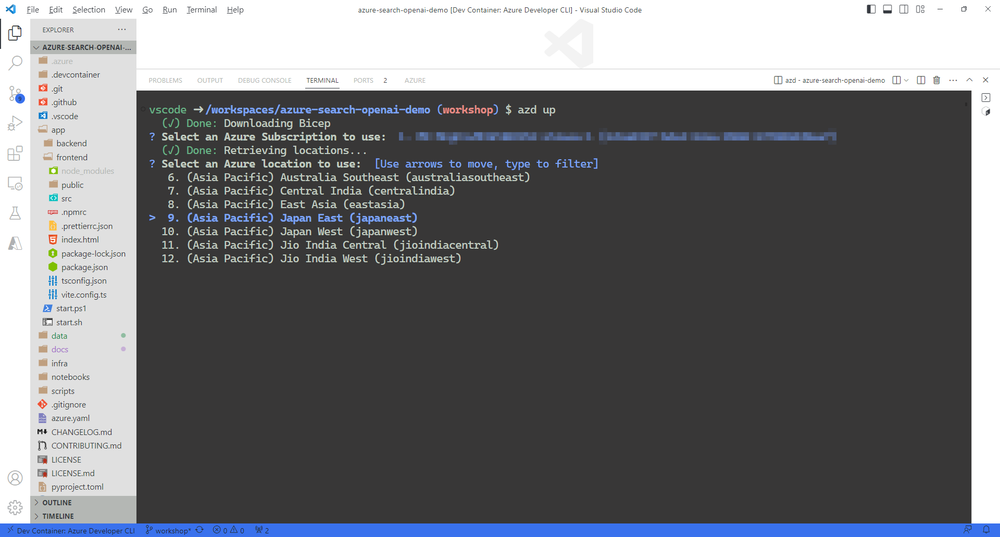

Azureのデプロイが終わると、データ登録のためのスクリプト「`prepdocs.py`」が実行されます。

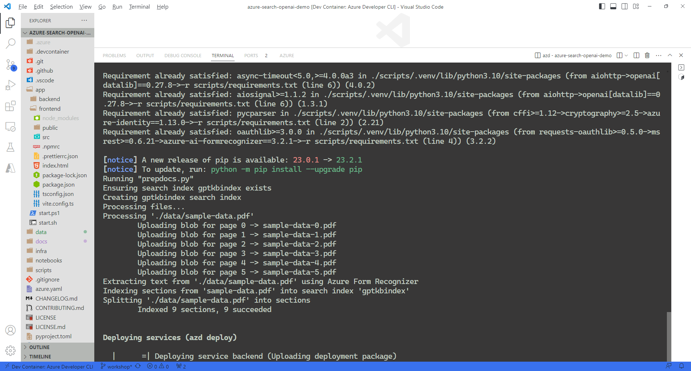

すべての環境構築が完了すると、次の画面になります。

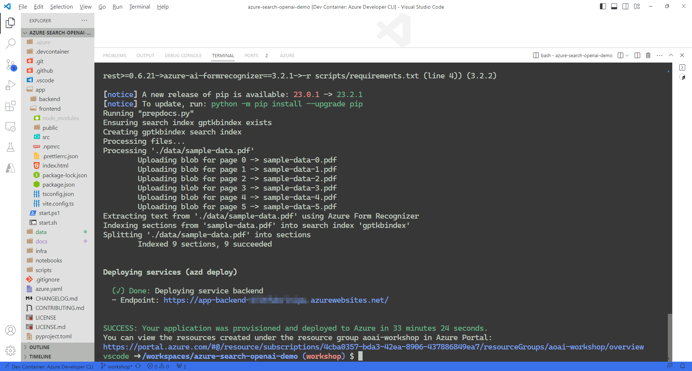


### Azure Developer CLIの構成
環境を構築している間に、azd テンプレートの構成を確認しましょう。次のディレクトリ構成となっています。

```bash
├── .devcontainer              [ DevContainer のための設定ファイル ]
├── .github                    [ GitHub workflowの設定ファイル ]
├── infra                      [ Azureリソースを作成するためのディレクトリ ]
│   ├── main.bicep             [ メインのIaCコード ]
│   ├── main.parameters.json   [ パラメータファイル ]
│   └── core                   [ リファレンスライブラリからコピーしたBicepモジュールなど ]
└── azure.yaml                 [ アプリケーションと Azure リソースの設定 ]
```

Azure Developer CLIでは、ワークフローとデプロイをカスタマイズするためのさまざまな拡張ポイントがサポートされています。フックを使用すると、コマンドと azd サービス ライフサイクル イベントの前後にカスタム スクリプトを実行できます。

|             名前             |                             説明                             |
| ---------------------------- | ------------------------------------------------------------ |
| prerestore / postrestore     | パッケージの依存関係が復元される前と後に実行                 |
| preprovision / postprovision | Azure リソースが作成される前と後に実行                       |
| predeploy / postdeploy       | アプリケーション コードが Azure にデプロイされる前と後に実行 |
| preup / postup               | 結合されたデプロイ パイプラインの前後に実行                  |
| predown / postdown           | リソースが削除される前と後に実行                             |


Azure Developer CLIでは、ワークフローとデプロイをカスタマイズするためのさまざまな拡張ポイントがサポートされています。フックを使用すると、コマンドと azd サービス ライフサイクル イベントの前後にカスタム スクリプトを実行できます。

たとえば今回のサンプルの場合、`azure.yaml`をみると`postprovision`フックが設定されているため、BicepによってAzureリソースが作成し終わったあとに、`./scripts/prepdocs.ps1`または`./scripts/prepdocs.sh`が実行されます。この`prepdocs.ps1/prepdocs.sh`は`/data`配下のPDFデータから文字情報を抽出しAzure Blob Storageにチャンク分割したファイルを格納してAzure Cognitive Searchにインデックスを登録しています。

```yaml
name: azure-search-openai-demo
metadata:
  template: azure-search-openai-demo@0.0.2-beta
services:
  backend:
    project: ./app/backend
    language: py
    host: appservice
    hooks:
      prepackage:
        windows:
          shell: pwsh
          run:  cd ../frontend;npm install;npm run build
          interactive: true
          continueOnError: false
        posix:
          shell: sh
          run:  cd ../frontend;npm install;npm run build
          interactive: true
          continueOnError: false
hooks:
    postprovision:
      windows:
        shell: pwsh
        run: ./scripts/prepdocs.ps1
        interactive: true
        continueOnError: false
      posix:
        shell: sh
        run: ./scripts/prepdocs.sh
        interactive: true
        continueOnError: false
```


?> azd コマンドの詳細については[ドキュメント](https://learn.microsoft.com/ja-jp/azure/developer/azure-developer-cli/overview)を参照してください。


デプロイの経過はAzure Portalからも確認できます。指定したリソースグループを開き、 **[設定]** - **[デプロイ]** をクリックするとリソースが表示されます。


なお作成されるAzure環境の全体構成はVisual Studio Codeの[Bicep Extention](https://marketplace.visualstudio.com/items?itemName=ms-azuretools.vscode-bicep)で可視化できます。


`infra\main.bicep`を選び右クリックで **[Open Bicep Visualizer]** をクリックすると構成がグラフィカルに表示されます。


なお、Azure環境の作成は40分程度かかります。


## 📝講義

Azureを利用するにあたり、セキュリティの設定は欠かせません。ここでは、Azure OpenAI Serviceはじめ、Azureの各種サービスを安全に利用するために知っておきたいネットワークセキュリティに関する講義を行います。


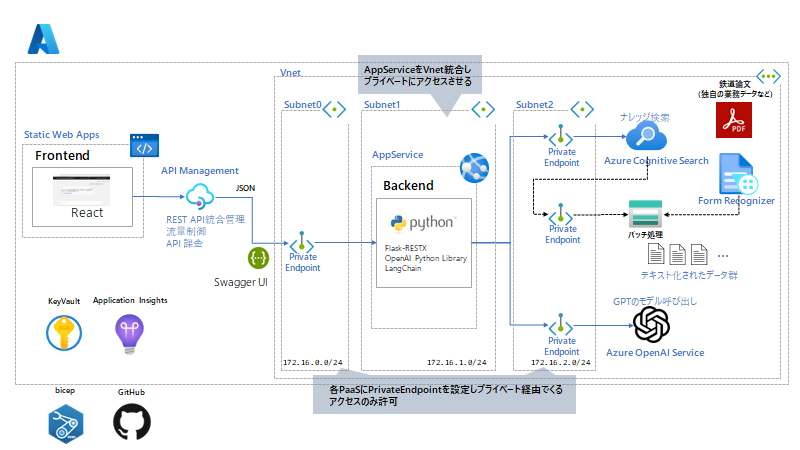


# **Part2: 業務データを利用したデータセットの作成** 
このパートでは、PDFなどの業務データからテキスト文字を抽出しデータセットを作成します。

?>ワークショップに必要なサンプルデータはあらかじめ`data`ディレクトリにあり、Part1の手順で既にデータセットの作成が完了しています。そのためこのパートは飛ばして、Part3に進んでもかまいません。


#### このパートのゴール
* Azure Form Recognizer を使ってドキュメントから文字データの抽出ができる

## 💻ハンズオン

### 1. データセットのテキスト化


Azure Form Recognizerは、Microsoft Azureのサービスの一つであり、OCR(Optical Character Recognition)と機械学習を利用してテキストを自動的に抽出し、構造化されたデータに変換するためのサービスです。

具体的には、Azure Form Recognizerは、さまざまな種類のドキュメントやフォーム(請求書/領収書/アンケート/契約書など)の画像やPDFファイルをアップロードし、その中のテキストを抽出します。OCRによって画像内の文字が読み取られ、機械学習モデルが文書の構造を解析し、データフィールド(日付/金額/住所など)を特定します。

Form Recognizerを使用することで、大量の紙文書や手書きのデータを手作業で入力する手間を省き、自動化されたデータ処理を実現できます。

Azure Form Recognizerは、APIとして提供されており、開発者は独自のアプリケーションやサービスに組み込むことができます。また、Azureポータルから使用することもできます。

Azureポータルを開き、Part1で作成したリソースグループ「**aoai-workshop**」にある「 **Form Recognizer** 」を選びます。

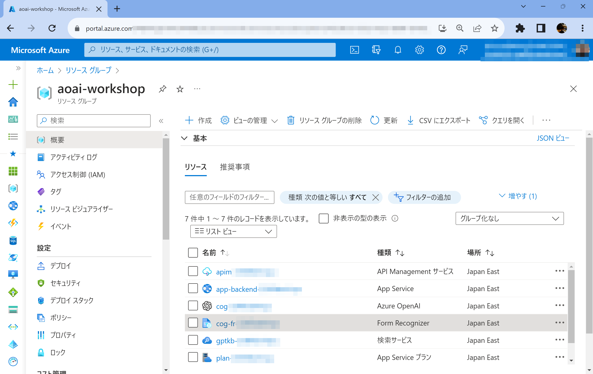


「 **Form Recognizerスタジオ** 」 を起動します。


次に、サブスクリプション/リソースグループ/Cognitive Service Resourceを設定してください。 
 


これはGUIでドキュメントの読み取りやレイアウトなどの構成を試すことができるツールです。


Form Recognizer Studioの [ **Browser for a file** ] をクリックして、ダミー論文をアップロードします。ダミー論文のPDFは`data\pdf\sample-data.pdf`にあります。


[ **Run analysis** ] をクリックしてPDFからテキスト情報を抽出します。


抽出したデータは`Context`で確認できます。また位置情報や一括取得するためのソースコード例も表示されるので、確認しましょう。


## 📖演習

Form Recognizerを使って、身近なドキュメントの読み取りを試してみましょう。そして精度や取得できる情報などを調べ、どう業務で活用できそうかをチームでディスカッションして発表しましょう。


?>**参考情報**<br>
[Azure Form Recognizer 製品情報](https://azure.microsoft.com/ja-jp/products/form-recognizer) <br>
[Azure Form Recognizer のドキュメント](https://learn.microsoft.com/ja-jp/azure/applied-ai-services/form-recognizer/?branch=release-build-cogserv-forms-recognizer&view=form-recog-3.0.0)<br>
[チュートリアル: Form Recognizer で Azure Logic Apps を使用する](https://learn.microsoft.com/ja-jp/azure/applied-ai-services/form-recognizer/tutorial-logic-apps?view=form-recog-2.1.0&viewFallbackFrom=form-recog-3.0.0)


# **Part3: 業務データの検索システム構築** 
このパートではサンプルデータではなく、独自データをもとに検索システムを作ります。次に、Azure OpenAI Serviceを使ってChatGPTで検索クエリーを作成し検索結果をもとに応答を返すREST APIを作成します。


#### このパートのゴール
* Azure Cognitive Searchを使って検索システムが作成できる
* Azure OpenAPI Service/Azure Cognitive Searchを呼び出すPythonプログラムをAppServiceで動かす

## 💻ハンズオン

### 1. Azure Cognitive SearchのIndex作成


Part1を実行すると、サンプルコードの`data`配下にある、「`sample-data.pdf`」というダミーデータをつかった検索システムが作成されます。

ここで、自社製品のマニュアル・研究論文・社内ドキュメントなどの実際の業務データを使うには、「`data/sample-data.pdf`」をいったん削除し、かわりに検索したい任意のPDFファイルを「`data/`」に格納します。

!>本ワークショップのサンプルはユーザ認証やネットワーク閉域化されていないため、インターネットに公開されても問題のないデータを利用してください。


Visual Studio Codeのターミナルから次のコマンドを実行してデータの登録と文字抽出、Cognitive SearchのIndex作成を行います。

```bash
$ scripts/prepdocs.sh
```

スクリプトが実行しおわったら、Azure Portalを開き、リソースグループ内のストレージアカウントをクリックします。


[ **データストレージ** ]-[ **コンテナ** ]をクリックすると`content`という名前のコンテナ―が作成されているのがわかります。


コンテナ―の中を確認すると、チャンク分割したPDFファイルが格納されています。
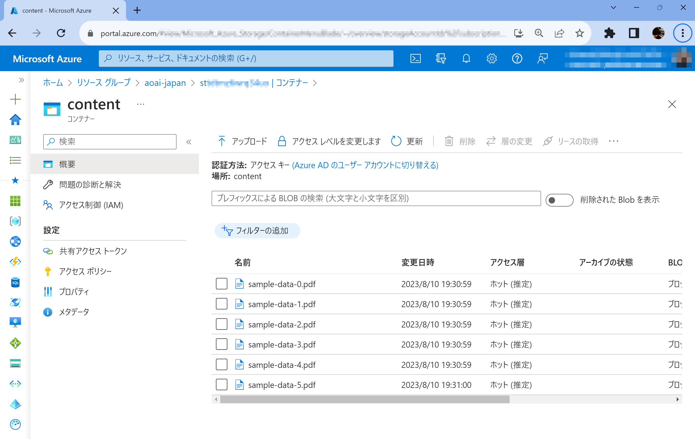


次にAzure Cognitive Searchを確認します。リソースグループ内の検索サービスをクリックします。

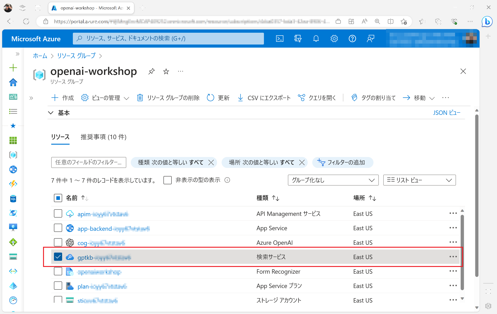

[ **設定** ]-[ **ナレッジセンター** ]をクリックし、[ **データの探索** ] タブをクリックします。


[ **検索エクスプローラの起動** ]をクリックします。


ここで、検索インデックスが「`gptkbindex`」になっていることを確認しクエリ文字列に「水素ハイブリット電車」と入力して [ **探索** ] ボタンをクリックします。応答で正しく検索結果が返っているのを確認します。

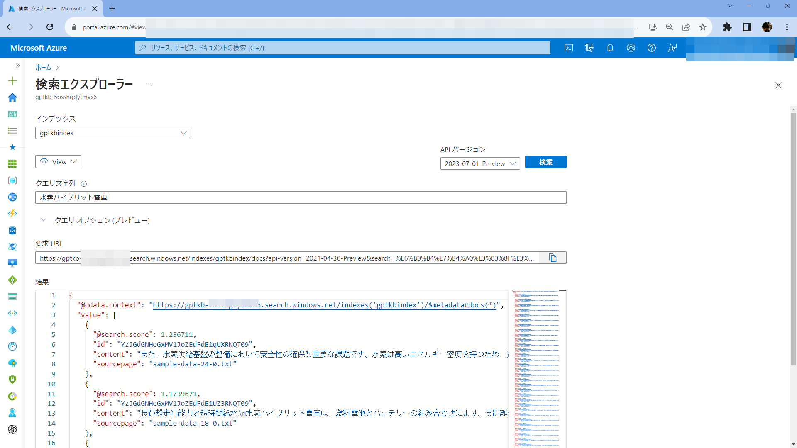


### 3. サンプルアプリのデプロイ

これで準備が出来上がったので検索データとAzure OpenAI Serviceを組み合わせた自然言語による応答を返すAPIを作成します。

サンプルのバックエンドアプリは「`app/backend`」、フロントエンドアプリは「`app/frontend`」ディレクトリにあります。


バックエンドアプリのコードを参照して、作成したデータに合うようプロンプトを修正します。コードの修正ポイントについては講師に確認してください。


バックエンドアプリはAzure AppServiceの[Web Apps](https://azure.microsoft.com/ja-jp/products/app-service/web)にデプロイします。

?> Azure AppServiceの[Web Apps](https://azure.microsoft.com/ja-jp/products/app-service/web)は、Azure上でWebアプリをホストするためのプラットフォームです。簡単に作成/デプロイ/スケーリングができ、さまざまなプログラミング言語やフレームワークに対応しています。高可用性とスケーラビリティを提供し、継続的なデプロイと統合もサポートしています。また認証やSSL証明書の統合などが出来るのが特徴です。

Visual Studio Codeのターミナルを開いて次のコマンドを実行します

```bash
azd deploy
```

Azure PortalからAPIのエンドポイントを確認します。リソースグループ内のApp Serviceを選択し、[ **概要** ]-[ **既定のドメイン** ]をクリップボードにコピーします。

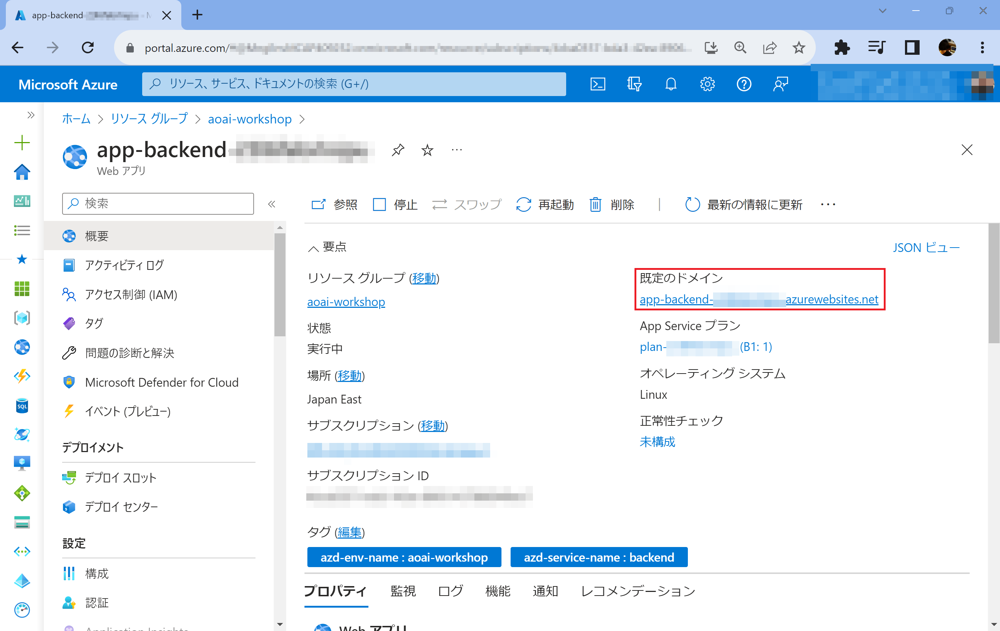

次のようなAPIエンドポイントが払い出されます。

```bash
app-backend-xxx.azurewebsites.net
```

次に、Visual Studio Codeでファイル「`REST.http`」を開きます。

?> Visual Studio CodeでREST APIの動作確認ができる拡張機能である「[REST Client](https://marketplace.visualstudio.com/items?itemName=humao.rest-client)」をつかっています。

ファイル内の`@backend`の部分を、払い出されたAPIのエンドポイントに変更してください。

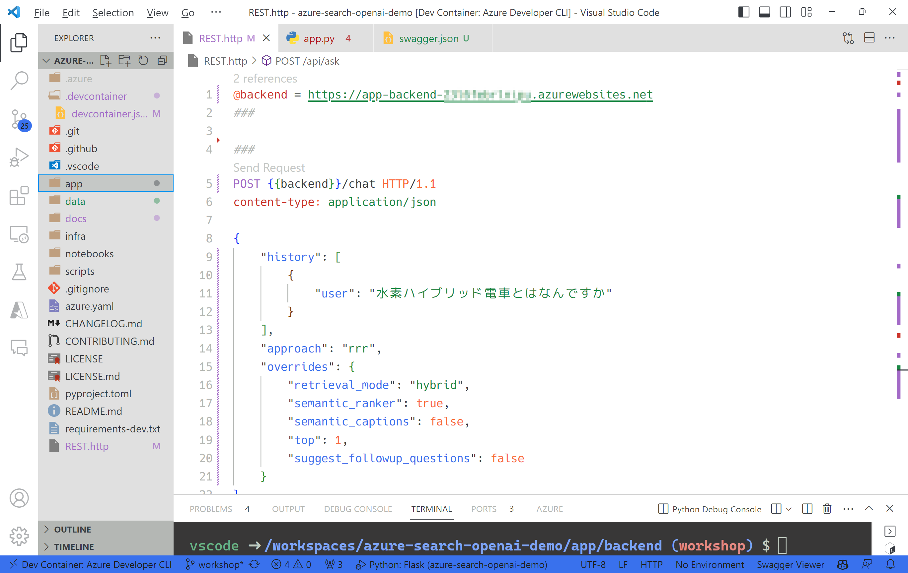


[ **Send Request** ]というリンクをクリックし、APIにリクエストを送信します。しばらくするとWebApps上のAPIから応答があります。


このサンプルのAPIの仕様はSwaggerで確認できます。Visual Studio Codeで`app/backend/swagger.json`を開きます。


次に、[`servers`]-[`url`]の値をデプロイしたAppServiceのエンドポイントに変更してファイルを上書き保存します。たとえばエンドポイントが「https://app-backend-xxx.azurewebsites.net」の場合は次のようになります。


```json
{
  "openapi": "3.0.0",
  "info": {
    "title": "Azure OpenAI Sample API",
    "description": "API to interact with chat and question-answering approaches.",
    "version": "1.0.0"
  },
  "servers": [
    {
      "url": "https://app-backend-xxx.azurewebsites.net"
    }
  ],
```


ここで、Visual Studio Codeの[`view`]-[`Command Palette`]を選択し、「`Preview Swagger`」を選びます。

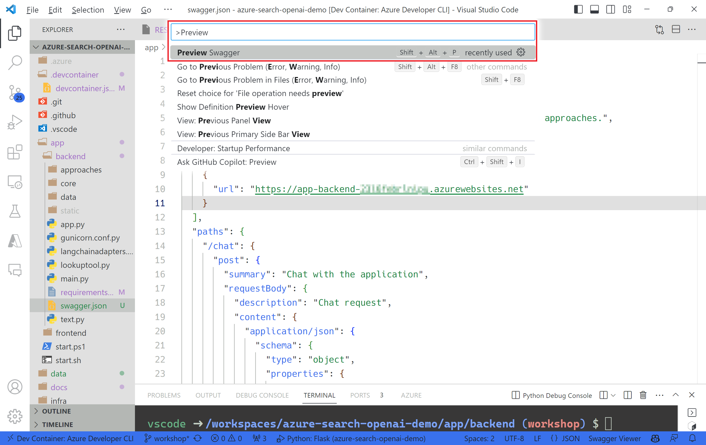


すると、Swagger Viewerが立ち上がり、APIの仕様を確認できます。たとえば、APIエンドポイントの`/ask`にリクエストを送るときのペイロードやStatus Codeが200(成功)の場合のレスポンスのデータを確認できます。

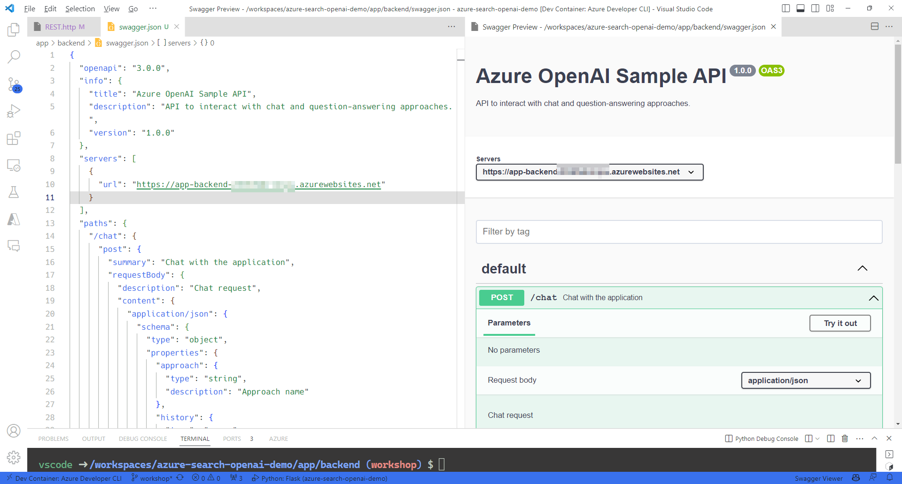


?> Swaggerは、RESTful Webサービスを記述、設計、構築、ドキュメント化するためのオープンソースのフレームワークです。Swaggerは、APIの仕様書を自動的に生成することができ、APIのエンドポイント、パラメータ、レスポンス、リクエストの形式、エラーコード、セキュリティ要件などを記述できます。Swaggerは、APIの設計とドキュメンテーションの作業を簡素化するだけでなく、開発者間の意思疎通を向上させるのに役立ちます。Swaggerは、JSONまたはYAML形式でAPIの仕様書を記述し、Swagger UIを使用して、WebブラウザでAPIの仕様書を見ることができます。


## 📖演習
今回のサンプルアプリのソースコードを確認しながら、チームでディスカッションして発表しましょう。

- Azure OpenAI は現在どのようなモデルが使えるのかを調べてみましょう。また、「責任あるAI」について業務データを利用するうえで考慮すべき点やセキュリティの原則を調べてみましょう。

[『ChatGPTによって描かれる未来とAI開発の変遷』日本マイクロソフト株式会社 蒲生 弘郷氏](https://www.youtube.com/watch?v=l9fpxtz22JU) 
<iframe width="560" height="315" src="https://www.youtube.com/embed/l9fpxtz22JU" title="YouTube video player" frameborder="0" allow="accelerometer; autoplay; clipboard-write; encrypted-media; gyroscope; picture-in-picture; web-share" allowfullscreen></iframe><br>


- このアプリはREST APIとして実装されています。`/ask`にリクエストを送信したときにどのような形式でデータが返るかを確認してください。また、`/chat`にリクエストをするときはどのようなデータをリクエストボディで送信する必要があるかを確認しましょう。

- サンプルアプリのプロンプトを変更することで、APIの結果がどのように変わるかを観察してください。

- AppService には組み込み認証認可の機能やGitHubとの連携機能など開発者に便利な機能が用意されています。ほかにもどのような機能があるか、どのような言語/ランタイムがサポートされているかを調べてみましょう。


?>**参考情報**<br>
[Azure OpenAI Service の製品情報](https://azure.microsoft.com/ja-jp/products/cognitive-services/openai-service) <br> 
[Azure OpenAI Service のドキュメント](https://learn.microsoft.com/ja-jp/azure/cognitive-services/openai/overview)<br>
[クイック スタート: Azure OpenAI Service で ChatGPT (プレビュー) と GPT-4 (プレビュー) の使用を開始する](https://learn.microsoft.com/ja-jp/azure/cognitive-services/openai/chatgpt-quickstart?pivots=programming-language-python&tabs=command-line)<br>
[Azure AppService Web Apps 製品情報](https://azure.microsoft.com/ja-jp/products/app-service/web)<br>
[Azure App Service のドキュメント](https://learn.microsoft.com/ja-jp/azure/app-service/)<br>
[クイックスタート: Python (Django または Flask) Web アプリを Azure App Service にデプロイする](https://learn.microsoft.com/ja-jp/azure/app-service/quickstart-python?tabs=flask%2Cwindows%2Cazure-cli%2Cvscode-deploy%2Cdeploy-instructions-azportal%2Cterminal-bash%2Cdeploy-instructions-zip-azcli)<br>


# **Part4: API統合管理基盤の作成** 
Azure Cognitive Search/Azure OpenAI Service/AppServiceを使って検索エンジンから自然言語で応答を返すAPIが作成できました。これをWebブラウザから利用できるシングルページアプリケーションやモバイルアプリケーション、ローコードツールで開発したアプリケーションなどから便利に利用できるよう、APIの統合管理を行います。

Azure API Managementは、APIを統合管理するサービスでAPIプロキシ/管理ポータル/ポリシー管理/分析などの機能を提供します。

Azure API Managementを使うと、クライアントアプリケーションとの間でリクエストとレスポンスを中継することで、トラフィック制御や認証/キャッシング/リトライ処理などができます。また、ログを収集することでどのぐらいAPIが利用されているかなどの情報を分析できたり、「APIを呼び出せるのは1分間に10回まで」などのポリシーを適用して流量を制御できます。

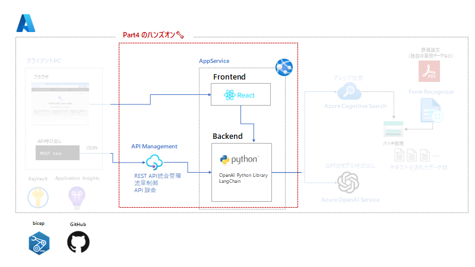

#### このパートのゴール
* API管理の必要性を理解する
* Azure API Managementを使ってAPIの管理ができる

## 💻ハンズオン
### 1. API ManagementへのAPI登録

それでは、API Managementに作成したAPIを登録します。
Azureポータルを開き、「`aoai-workshop`」リソースグループ内のAPI Managementサービスを選びます。


[ **API** ] - [ **+ Add API** ]をクリックします。


API Managementで管理したいAPIを登録します。今回は[`OpenAPI`]を選びます。

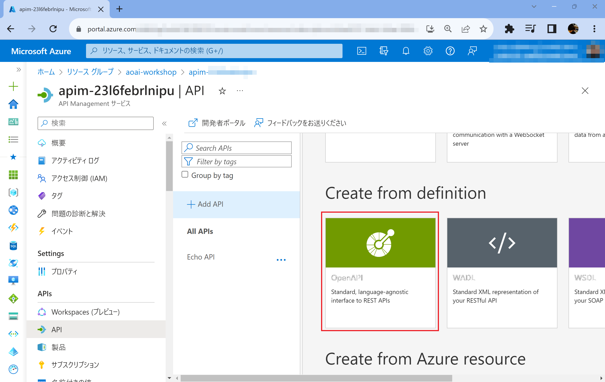

次に、[ **Create from OpenAPI specification** ]ダイアログが表示されるので、「 **OpenAPI specification** 」に`data/backend/swagger.json`ファイルを指定します。「 **API URL suffix** 」には「`api`」を指定します。


これで登録が出来ましたので、APIを確認します。たとえば「`Ask a question to the application`」をクリックすると、クライアントアプリケーションから`/ask`にリクエストがきたときに「**Inboud processing** 」を通って「 **Backend** 」にリクエストが転送されるのがわかります。このBackendでは、APIをホストしたAppServiceのエンドポイントになっているのが確認できます。またBackendからのレスポンスは「**Outbound processing** 」を通って「**Frontend** 」に応答が返ります。

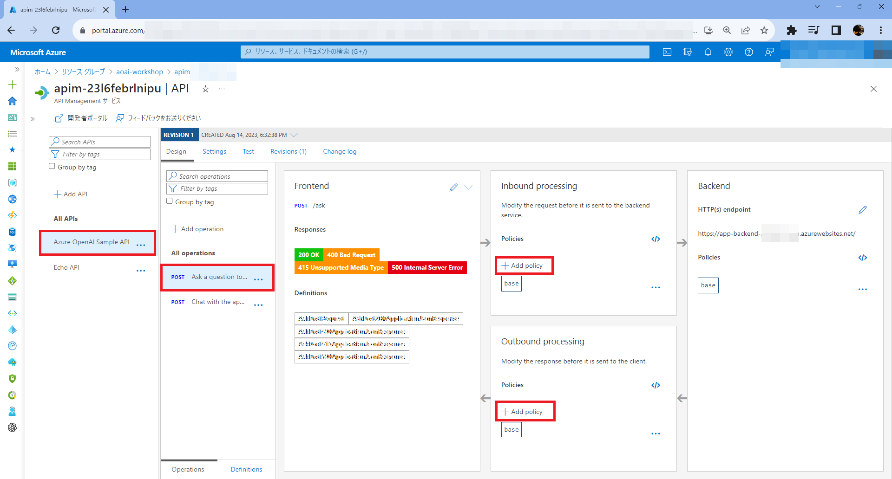

ヘッダの書き換えやJWT検証、IPアドレスによる制限や流量制御などのポリシーが必要な場合は、「**Add Policy**」をクリックして追加します。


### 2. APIの動作確認

APIの登録ができたので、動作確認をします。

まず、API Managementを経由した場合のエンドポイントを確認します。[**概要**]の[**ゲートウェイのURL**]をコピーします。


次に、Visual Studio Codeを開き、「`REST.http`」をクリックします。ここで、`@apimanagament`の値に、コピーしたゲートウェイのURLを貼り付けます。

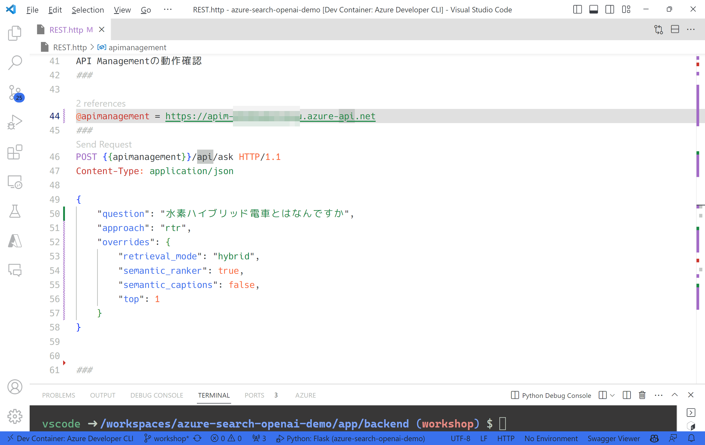

ここで「Send Request」をクリックすると、「401 Access Denied」が返ります。これはAPIに対して適切な権限がないためのエラーです。

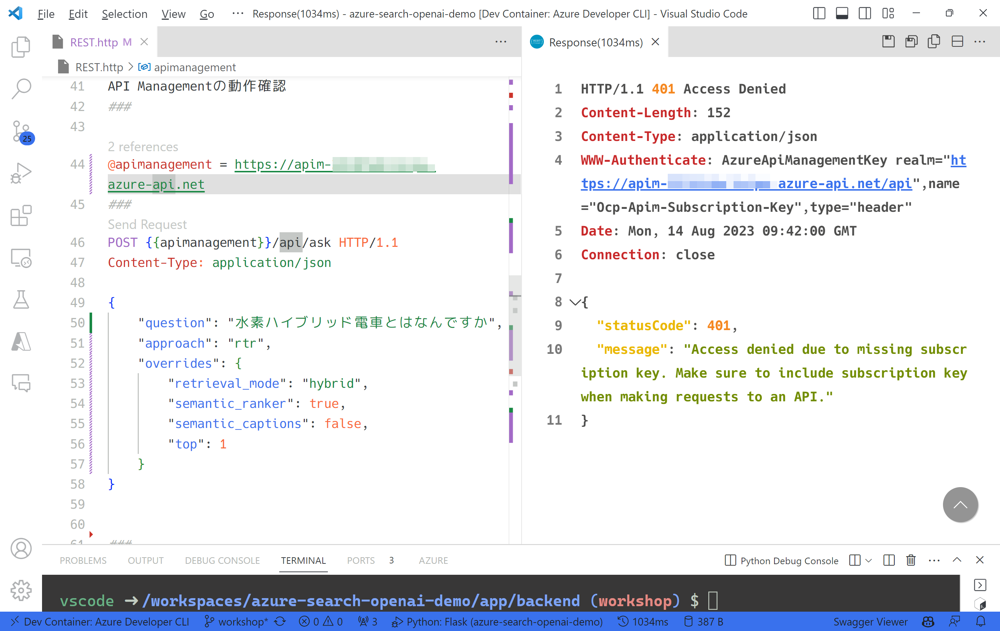

そこで、APIのアクセスキーをリクエストに設定します。まずAzureポータルを開き、「 **サブスクリプション** 」から「 **Built-in all-access subscription** 」を選び、「 **キーの表示/非表示** 」を選びます。これで表示されたキーをコピーします。

!>これはすべてのAPIにアクセスできる強力な権限をもつキーです。本番環境で利用するときは適切なスコープ/権限を持ったキーを生成して運用してください。


Visual Studio Codeに戻り、リクエストヘッダの`Ocp-Apim-Subscription-Key`という値にコピーしたAPI Managementのキーを設定して再度リクエストを送信します。
すると、正しくAPIから応答が返ってくるのがわかります。


これでAPIの管理ができました。クライアントアプリケーションからのリクエストとレスポンスを一元管理できるので、アクセス制御だけでなくポリシーの設定やロギングなどもまとめて管理できます。なお、本番環境で運用するときはAPIキーによる認証ではなく、Azure AD認証 (RBAC)を強くお勧めします。 


## 📖演習

API Managementは高機能なAPI管理サービスです。次のような課題に対してどのように実現できるかチームでディスカッションして発表しましょう。

- `/ask`エンドポイントに対して、1分間に5回以上の呼び出しができないようにポリシーを設定しましょう。

- API ManagemetでAPI使用のアクセスログを取る方法はどのような方式があるでしょうか？またどのような情報が取得できるか確認しましょう。

- API ManagementではAPIをまとめて管理する「製品」と呼ばれる機能があります。これを使うとどのようにサブスクリプション管理できるでしょうか？

- API Management ポータルは、APIのドキュメント、使用方法、ポリシーガイドラインなどの情報を提供します。開発者はポータルからAPIを探索し、利用登録を行い、APIキーを取得して利用できます。実際に試してみてどのように活用できそうかディスカッションしてみましょう。


?>**参考情報**<br>
[API Management の製品情報](https://azure.microsoft.com/ja-jp/products/api-management)<br>
[API Management のドキュメント](https://learn.microsoft.com/ja-jp/azure/api-management/)<br>
[API Management ポリシー](https://learn.microsoft.com/ja-jp/azure/api-management/api-management-howto-policies)<br>
[チュートリアル:発行された API を監視する](https://learn.microsoft.com/ja-jp/azure/api-management/api-management-howto-use-azure-monitor)<br>
[チュートリアル:開発者ポータルへのアクセスとそのカスタマイズ](https://learn.microsoft.com/ja-jp/azure/api-management/api-management-howto-developer-portal-customize)<br>
[API 認可とは](https://learn.microsoft.com/ja-jp/azure/api-management/authorizations-overview)


# 🗑Azureリソースの削除
本ワークショップで使用したすべてのAzureリソースを削除するときは、Visual Studio Codeのターミナルで次のコマンドを実行して下さい。

```bash
azd down
```

おつかれさまでした☕


---
# **参考: Logic App を使って Form Recognizer で PDF をテキスト化する** 
Azure OpenAI と Cognitive Search を連携する場合、ドキュメントのテキスト化が必要な場合があります。Python 、REST API等で Form Recognizer と連携することで PDF や PNG 等のドキュメントをテキスト化することができます。
また、Logic App を使うことでノーコードで実施することもできますので、手順を以下に記載します。

事前準備：
- Azure Form Recognizer リソースがデプロイ済みであること
- Azure BLOB ストレージがデプロイ済みで、データ取得、データ配置用のコンテナが一つずつあること
- 各リソースのファイアウォールはパブリックで公開されていること

手順：
1. Logic App リソースを従量課金プランで作成します。
2. ロジックアプリデザイナーで以下のようなワークフローを作っていきます。
3. 作成が終わったら、ストレージにテキスト化したい PDF ファイルを配置し、トリガーを実行します。

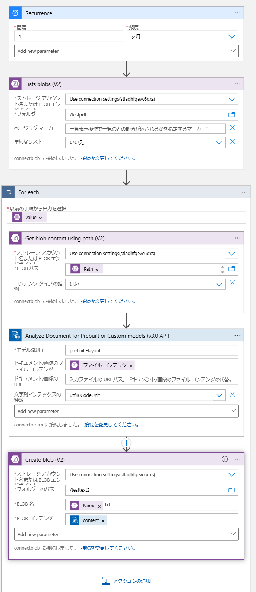

ワークフロー内では以下を実施しています。
1. スケジュールトリガー (手動で起動するために使っていますが、他のトリガーも可)
2. ストレージのコンテナ内を List
4. 各ファイルを取得
5. Form Recognizer でファイルをテキスト化 (簡易手順ですのでファイル名は xxx.pdf.txt となってます)
6. テキスト化されたコンテンツをファイルとして、ストレージに配置

Azure BLOB ストレージへの認証は以下を選択可能です。


テキスト化が成功すると、以下のような形で、PDF 形式のファイルがテキストに変換されます。

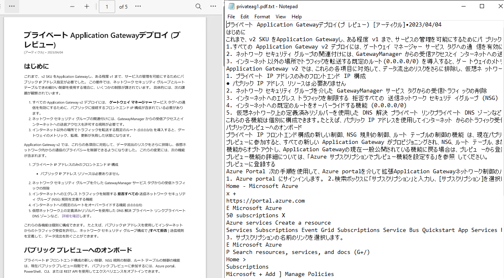

こちらのテキストをベースに Cognitive Search の Index を作成することで該当のドキュメントの内容を連携できるようになります。


