# **業務データを活用したAIチャットシステム ワークショップ**

OpenAIによって開発された大規模な言語モデルGPTを活用すると、テキスト生成/自然言語理解/文章の翻訳などのさまざまなタスクをこなすことができます。これらを業務に活用することで、これまで負荷のかかっていた作業を省力化できる可能性があるため、大きく注目されています。

たとえば、業務ナレッジ/設計書/技術文書/製品メンテナンス情報がPDF/PowerPoint/Excelファイルでばらばらに管理されている企業は多いのではないでしょうか？これらの中には非常に有用な情報であるにもかかわらず、社内で十分に有効活用されていない、また必要な情報にたどり着くまでに時間がかかり生産性の低下をおこしたりコミュニケーションコストの増大をおこしていることもあります。

例えば、<span style="font-weight: bold; color: steelblue;"> 「私は水素ハイブリット電車の設計者です。〇〇の設計上の注意点は何ですか？」</span>   と自然言語で専門用語や業務固有のナレッジについて問い合わせると、GPTが適切なクエリを生成して必要な情報を検索します。その検索結果をさらに集約して、質問者の問いに対するピンポイントな回答や要約ができれば、<span style="font-weight: bold; color: steelblue;"> 「〇〇さんに聞かなければわからない貴重なノウハウ」「どこにあるか分からない情報を捜すのに苦労している」</span>など現場の多くの課題を解決できます。

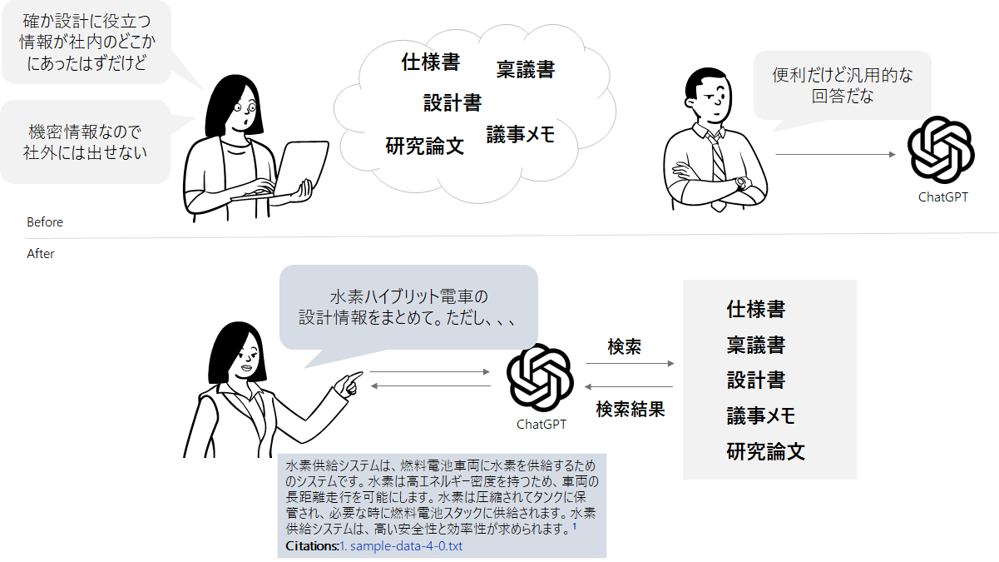

このシステムを社内導入するためには、GPTなどAIそのものの知識に加えて、AIを組み込んだWebアプリケーションをどう実装するか？や、セキュリティを担保しつつどう運用管理するか？などの幅広い知識が求められます。

---

このワークショップでは、 <span style="font-weight: bold; color: steelblue;"> 研究論文のサマリー/アジェンダを作成するチャットシステム</span> の作成を通して、Azure OpenAI Service やAzure Cognitive Searchなどの使い方やチャットシステムを社内に展開するためのWebアプリケーションの作成やAPI基盤の整備などの基礎を学びます。

このワークショップの特徴は次の2つです。

- **専門用語や業界独自のナレッジを検索できる**

ChatGPT(gpt-35-turbo)モデルでトレーニングされたデータに基づいてテキストを生成するのではなく、企業内に閉じたデータのみから生成します

- **回答の根拠を明確にする**

ChatGPTの回答に「引用」をテキストに付加することで信頼できる応答を生成します


このワークショップは、AI技術に興味のあるデータサイエンティスト、エンジニア、研究者、または企業内での情報アクセスやナレッジ共有の改善を目指す方々に適しています。

本ワークショップで作成したAPIは、WebアプリだけでなくモバイルアプリケーションやPowerAppsなどのローコードアプリケーションからも利用できます。


参考: PowerAppsでの例


## 🔧事前準備

ワークショップを始める前に、お使いの開発マシンに次の環境を準備します。
* [Visual Studio Codeのインストール](https://code.visualstudio.com/download)
* [Dockerのインストール](https://www.docker.com/get-started)
* [GitHubアカウントの作成](https://github.co.jp/)

!> このワークショップを実行するには、 **Azure OpenAI Service へのアクセスを有効にした** Azure サブスクリプションが必要です。アクセスは[こちら](https://aka.ms/oaiapply)からリクエストできます。

本ワークショップの受講者は、基本的なAzureの知識とAzure ポータルでの操作経験を前提としています。またGitHubの操作経験と基本的なプログラミング知識が必要となります。

---
# **Part1: Azure環境構築と検索データ作成** 

このパートでは、ワークショップをおこなう上で必要なAzure環境を構築します。


ワークショップでは、ダミー論文をデータセットとして利用します。実際の業務データを使いたい場合は、データを用意してください。


#### このパートのゴール
* Bicepを活用したコードによるAzure環境の構築や管理の流れを知る
* Form RecognizerをつかってPDFからOCRができることを確認する


## 💻ハンズオン
### 1. サンプルアプリケーションの準備

ご自身のアカウントでGitHubを開き、[こちら](https://github.com/asashiho/azure-search-openai-demo)のサンプルコードを自分のリポジトリにForkします。

次のコマンドを実行してForkしたリポジトリをクローンします。

```bash
git clone https://github.com/<Your_GitHub_Name>/azure-search-openai-demo
```


次にVisual Studio Codeを起動します。 **[表示]-[拡張機能]** を選び、検索で **「Dev Containers」** を選び、この拡張機能を **[インストール]** をします。これはコンテナ環境で開発環境を動かすための拡張機能です。


次に **[ファイル]-[フォルダを開く]** を選び **「azure-search-openai-demo」** フォルダを開いてください。

!>もし異なるフォルダを開いている場合、本ワークショップで必要な環境がセットアップされませんので、注意してください。


サンプルフォルダを開いたら、Visual Studio Codeの左下の[`><`]アイコンをクリックして「`ReOpen in Container`」を選びます。


しばらくすると、[`>< Dev Container: Python3`]となり、次のようなターミナル(コマンドを実行する箇所)が表示されます。これは、開発に必要な環境一式がDockerコンテナとして起動できるVisual Studio CodeのDevContainersという機能を使っています。もしエラー等で起動できない場合は、ローカルPCでDockerコンテナが動作しているかを確認してください。


これで開発の準備ができました。


?>**コンテナを活用した開発環境の構築**<br>
アプリケーションを開発するときに、まず行うべきことは開発環境の作成です。言語ランタイムやライブラリをデバッグやテストに必要なツール群をインストール・設定する必要があります。
Visual Studio CodeのRemote-Containers 拡張機能を使用すると、開発環境をDockerコンテナで動かすことができます。
コンテナ内に開発環境を閉じ込めることができるため、ランタイムバージョンの異なる環境・開発言語が異なる環境もコンテナを切り替えるだけで利用できます。
また、標準化した環境を作成するためのDockerfileを作っておけば、大規模プロジェクトで複数の開発するメンバーが参画するときも、コンテナイメージを共有すればよいだけので、統一された環境をつかって開発を始めることができます。<br>
 公式ドキュメント:「[Developing inside a Container](https://code.visualstudio.com/docs/remote/containers)」


### 2. Azure環境の作成
本ワークショップで使用するAzureの環境を構築します。Visual Studio Codeを起動し、ターミナルを開きます。


ターミナルに次のコマンドを入力してAzureにログインします。そしてAzure OpenAI Serviceが利用可能なAzureサブスクリプションを設定します。

例えば、サブスクリプションIDが「`aaaaaaaa-bbbb-cccc-dddddddddddd`」の場合、次のコマンドを実行します。

```bash
az login
az account set --subscription aaaaaaaa-bbbb-cccc-dddddddddddd
```

!>必ずAzure OpenAI Serviceが利用可能なサブスクリプションを指定してください。

次に、Azure AD のオブジェクトIDを確認します。このオブジェクトIDは次の手順で利用しますので値をひかえてください。

```bash
az ad signed-in-user show --query id --out tsv
```

本ワークショップで使用するAzure環境はBicepで構築します。Visual Studio Codeのターミナルで次のコマンドを実行します。

```bash
cd infra

az bicep upgrade

az deployment sub create \
  -l eastus \
  --template-file main.bicep
```

コマンドを実行すると次の値を聞かれるので、自身の環境にあわせて入力します。

|      項目       |                                                                                                        設定内容                                                                                                         |                設定例                |
| --------------- | ----------------------------------------------------------------------------------------------------------------------------------------------------------------------------------------------------------------------- | ------------------------------------ |
| principalId     | 上記手順で実行した`az ad signed-in-user show`コマンドで出力されたオブジェクトID                                                                                                                                         | xxxxxxxx-xxxx-xxxx-xxxx-xxxxxxxxxxxx |
| environmentName | 任意の名前                                                                                                                                                                                                              | openai-workshop                      |
| location        | Azure OpenAI Serviceの「`text-davinci-003`」モデルが利用可能な[リージョン](https://learn.microsoft.com/ja-jp/azure/cognitive-services/openai/concepts/models#model-summary-table-and-region-availability)を指定します。 | eastus                               |
| publisherEmail  | API Managamentの管理者のメールアドレス                                                                                                                                                                                  | hoge@fuga.com                        |
| publisherName   | API Managamentの管理者の名前                                                                                                                                                                                            | hoge                                 |


デプロイの経過はAzure Portalからも確認できます。指定したリソースグループを開き、 **[設定]** - **[デプロイ]** をクリックするとリソースが表示されます。

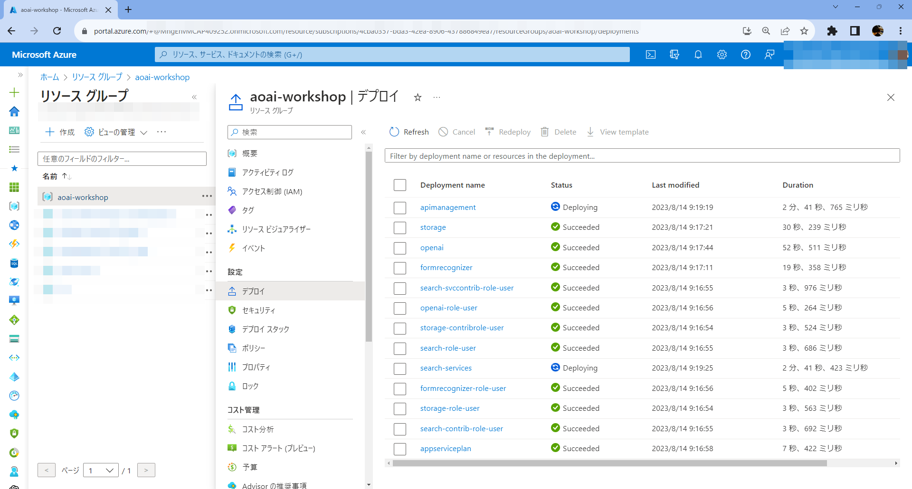


なお作成されるAzure環境の全体構成はVisual Studio Codeの[Bicep Extention](https://marketplace.visualstudio.com/items?itemName=ms-azuretools.vscode-bicep)で可視化できます。


`infra\main.bicep`を選び右クリックで**[Open Bicep Visualizer]** をクリックすると構成がグラフィカルに表示されます。


Azure環境の作成は40分程度かかります。コマンドはそのままで次の手順3に進んでください。


### 3. データセットのテキスト化
?>ワークショップに必要なデータはあらかじめ`data`ディレクトリに準備されています。そのためこの手順は飛ばして、Part2に進んでもかまいません。またお手持ちのデータをもとに検索を行いたい場合は、データを差し替えてください。

Azure Form Recognizerは、Microsoft Azureのサービスの一つであり、OCR(Optical Character Recognition)と機械学習を利用してテキストを自動的に抽出し、構造化されたデータに変換するためのサービスです。

具体的には、Azure Form Recognizerは、さまざまな種類のドキュメントやフォーム(請求書/領収書/アンケート/契約書など)の画像やPDFファイルをアップロードし、その中のテキストを抽出します。OCRによって画像内の文字が読み取られ、機械学習モデルが文書の構造を解析し、データフィールド(日付/金額/住所など)を特定します。

Form Recognizerを使用することで、大量の紙文書や手書きのデータを手作業で入力する手間を省き、自動化されたデータ処理を実現できます。

Azure Form Recognizerは、APIとして提供されており、開発者は独自のアプリケーションやサービスに組み込むことができます。また、Azureポータルから使用することもできます。

Azureポータルを開き、「 **Form Recognizer** 」を選びます。


**[+ 作成]** ボタンをクリックします。


プロジェクトの詳細でサブスクリプションとリソースグループ「`openai-workshop`」を選びます。


インスタンスの詳細で以下を設定します。

|    項目    |                          設定値                          |
| ---------- | -------------------------------------------------------- |
| リージョン | East US                                                  |
| 名前       | 任意の名前(グローバルで一意となるように設定してください) |
| 価格レベル | Free F0                                                  |


本番環境で利用するときは、ネットワークセキュリティ/Identityを適切に構成する必要がありますが、本ワークショップではデフォルトのままとします。


設定項目に誤りが無ければ、[ **作成** ] ボタンをクリックします。


リソースが作成できたら、「 **Form Recognizerスタジオ** 」 を起動します。
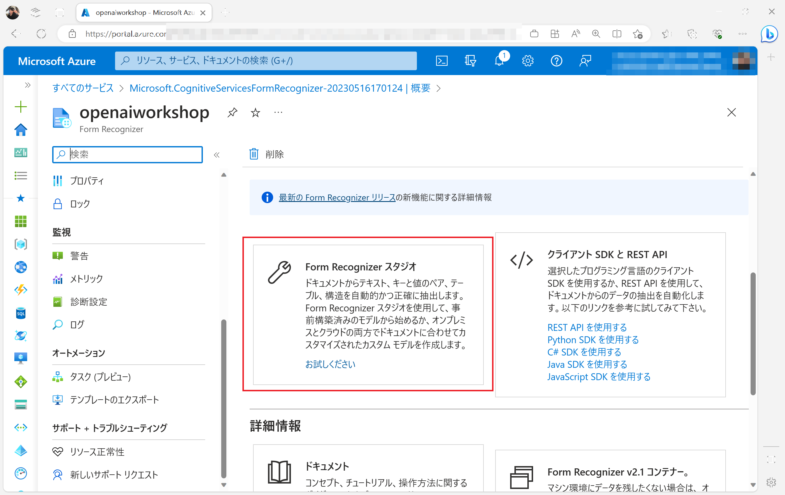

これはGUIでドキュメントの読み取りやレイアウトなどの構成を試すことができるツールです。


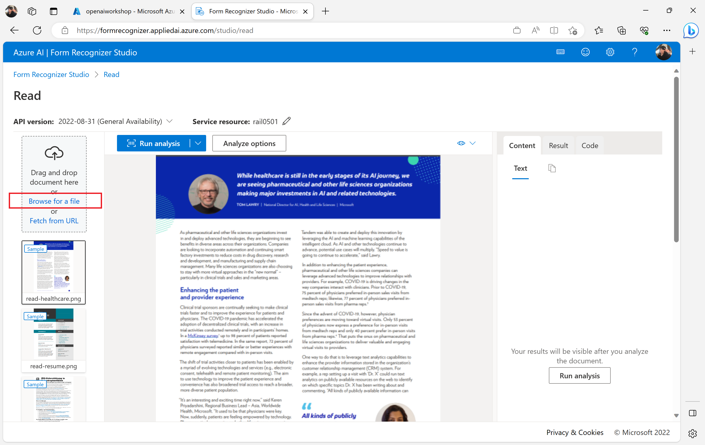

Form Recognizer Studioの [ **Browser for a file** ] をクリックして、ダミー論文をアップロードします。ダミー論文のPDFは`data\pdf\sample-data.pdf`にあります。


[ **Run analysis** ] をクリックしてPDFからテキスト情報を抽出します。


抽出したデータは`Context`で確認できます。また位置情報や一括取得するためのソースコード例も表示されるので、確認しましょう。

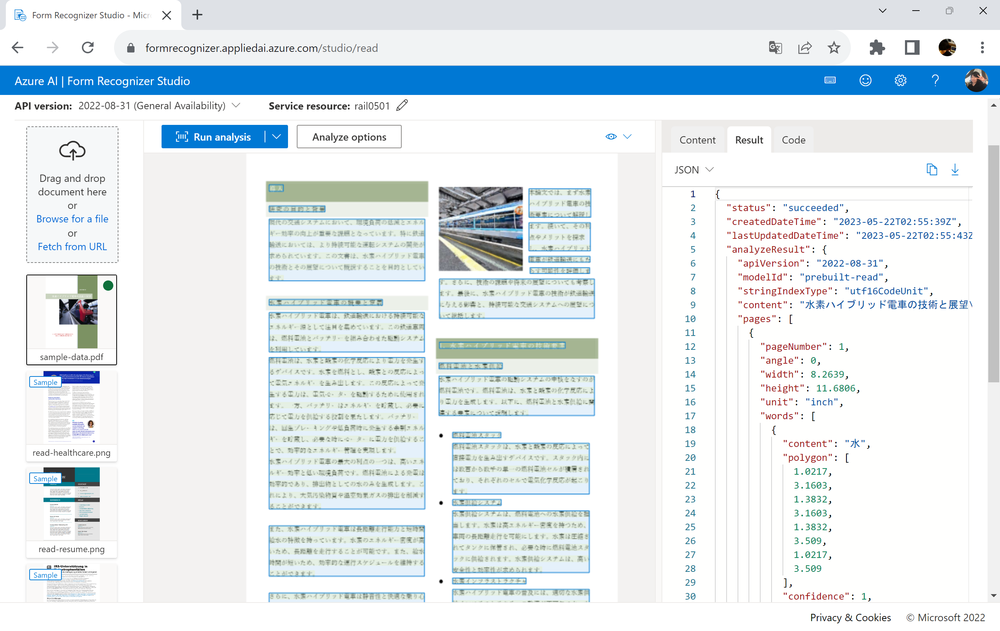


これらのテキスト情報から検索システムを作成します。なお、本ワークショップでは、あらかじめPDFから抽出したテキスト情報を`data` ディレクトリに格納しています。


## 📖演習

Form Recognizerを使って、身近なドキュメントの読み取りを試してみましょう。そして精度や取得できる情報などを調べ、どう業務で活用できそうかをチームでディスカッションして発表しましょう。

また、大量のデータを一括で変換するにはどのような方法が良いか議論してみてください。

?>**参考情報**<br>
[Azure Form Recognizer 製品情報](https://azure.microsoft.com/ja-jp/products/form-recognizer) <br>
[Azure Form Recognizer のドキュメント](https://learn.microsoft.com/ja-jp/azure/applied-ai-services/form-recognizer/?branch=release-build-cogserv-forms-recognizer&view=form-recog-3.0.0)<br>
[チュートリアル: Form Recognizer で Azure Logic Apps を使用する](https://learn.microsoft.com/ja-jp/azure/applied-ai-services/form-recognizer/tutorial-logic-apps?view=form-recog-2.1.0&viewFallbackFrom=form-recog-3.0.0)


# **Part2: 業務データの検索システム構築** 
このパートではまず作成したテキストデータをもとに検索システムを作ります。次に、Azure OpenAI Serviceを使ってChatGPTで検索クエリーを作成し検索結果をもとに応答を返すREST APIを作成します。

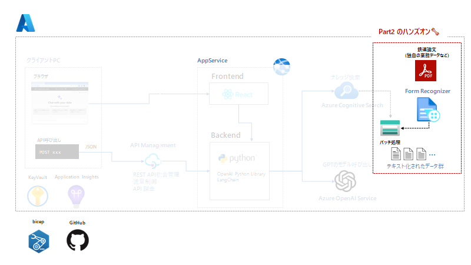


#### このパートのゴール
* Azure Cognitive Searchを使って検索システムが作成できる
* Azure OpenAPI Service/Azure Cognitive Searchを呼び出すPythonプログラムをAppServiceで動かす

## 💻ハンズオン

### 1. データセットのチャンク分割
?>ワークショップに必要なデータはあらかじめ`data`ディレクトリに準備されています。そのためこの手順は飛ばして、手順2に進んでもかまいません。またお手持ちのデータをもとに検索を行いたい場合は、データを差し替えてください。

次に用意したテキストデータをChatGPTで扱えるようチャンク分割していきます。
Visual Studio Codeを開き`notebook/TextChunking.ipynb`をダブルクリックします。

本ワークショップ環境はJupyter Notebookの環境がセットアップされていますので、次のようなNotebookが表示されます。


Jupyter Notebookのセルを1つずつ実行します。実行はセル左の **[▷]** ボタンをクリックします。


1 つのドキュメントに含まれるトークン数は1度のコンテキストに指定できる最大トークン数を超えます。ドキュメントの文を指定したトークン数となるよう以下のチャンクに分割します。

- テキストの分割方法

`RecursiveCharacterTextSplitter` はチャンクが十分に小さくなるまで、順番に分割

- チャンクサイズの測定方法

[tiktoken](https://github.com/openai/tiktoken)ライブラリのトークナイザーを使用してトークン数を測定

すべてのセルを実行し終わると、結果が`data/output/`以下にテキスト形式で格納されます。中身を確認してみましょう。


ここで作成したデータセットをもとに検索を行います。


### 2. Azure Cognitive SearchのIndex作成

Azureの環境が構築できたら、作成したデータセットをAzure Blob Storageに格納し、Azure Cognitive Searchにインデックスを登録します。

登録のためのPythonのスクリプトは以下のフォルダにあります。まず環境変数'RG_NAME'にAzureのリソースグループ名を設定します。

```bash
cd ../scripts/
export RG_NAME=openai-workshop
```


次のコマンドを実行してAzure Cognitive Searchの名前を環境変数`AZURE_SEARCH_SERVICE`に設定します。

```bash
export AZURE_SEARCH_SERVICE=$(az deployment group show \
  -g $RG_NAME \
  -n search-services \
  --query properties.outputs.name.value \
  --output tsv)
echo $AZURE_SEARCH_SERVICE
```

Azure Cognitive Searchのインデックス名を環境変数`AZURE_SEARCH_INDEX`に設定します。
```bash
export AZURE_SEARCH_INDEX="gptkbindex"
```

データの保存先であるAzure Blog Strageにアクセスするためのストレージアカウント名を環境変数`AZURE_STORAGE_ACCOUNT`に設定します。

```bash
export AZURE_STORAGE_ACCOUNT=$(az deployment group show \
  -g $RG_NAME \
  -n storage \
  --query properties.outputs.name.value \
  --output tsv)
echo $AZURE_STORAGE_ACCOUNT
```

同様にAzure Blog Strageのコンテナ名を環境変数`AZURE_STORAGE_CONTAINER`に設定します。

```bash
export AZURE_STORAGE_CONTAINER="content"
```

Azure Cognitive Searchのアクセスキーを環境変数`AZURE_SEARCH_KEY`に設定します。

```bash
export AZURE_SEARCH_KEY=$(az search admin-key show \
  --resource-group $RG_NAME \
  --service-name $AZURE_SEARCH_SERVICE \
  --query "primaryKey" \
  --output tsv)
echo $AZURE_SEARCH_KEY
```

これで準備が整いました。

次に、インデックス作成のためのPythonプログラム`prepdocs.py`を実行します。元となるデータは`/data/output/`に格納されているものとします。

```bash
pip install -r requirements.txt

python prepdocs.py '../data/output/*' \
  --storageaccount $AZURE_STORAGE_ACCOUNT  \
  --container $AZURE_STORAGE_CONTAINER \
  --searchservice $AZURE_SEARCH_SERVICE \
  --searchkey $AZURE_SEARCH_KEY \
  --index $AZURE_SEARCH_INDEX -v
```

Azure Portalを開き、リソースグループ内のストレージアカウントをクリックします。

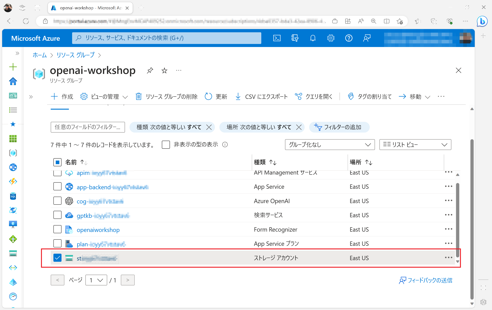

[ **データストレージ** ]-[ **コンテナ** ]をクリックすると`content`という名前のコンテナ―が作成されているのがわかります。


コンテナ―の中を確認すると、チャンク分割したテキストファイルが格納されています。


次にAzure Cognitive Searchを確認します。リソースグループ内の検索サービスをクリックします。


[ **設定** ]-[ **ナレッジセンター** ]をクリックし、[ **データの探索** ] タブをクリックします。


[ **検索エクスプローラの起動** ]をクリックします。


ここで、検索インデックスが「`gptkbindex`」になっていることを確認しクエリ文字列に「水素ハイブリット電車について教えてください」と入力して [ **探索** ] ボタンをクリックします。応答で正しく検索結果が返っているのを確認します。


### 3. バックエンドアプリのデプロイ

これで準備が出来上がったので検索データとAzure OpenAI Serviceを組み合わせた自然言語による応答を返すAPIを作成します。

サンプルのバックエンドアプリは次のフォルダにあります。
```bash
cd ../app/backend
```

バックエンドアプリはAzure AppServiceの[Web Apps](https://azure.microsoft.com/ja-jp/products/app-service/web)にデプロイします。

?> Azure AppServiceのWeb Appsは、Azure上でWebアプリをホストするためのプラットフォームです。簡単に作成/デプロイ/スケーリングができ、さまざまなプログラミング言語やフレームワークに対応しています。高可用性とスケーラビリティを提供し、継続的なデプロイと統合もサポートしています。また認証やSSL証明書の統合などが出来るのが特徴です。

Visual Studio Codeのターミナルを開いて次のコマンドを実行します。ここでは、WebAppsの名前を環境変数`APPSERVICE_NAME`に設定します。

```bash
export APPSERVICE_NAME=$(az deployment group show \
  -g $RG_NAME \
  -n web \
  --query properties.outputs.name.value \
  --output tsv)
echo $APPSERVICE_NAME
```

すでにWebAppsの環境は出来上がっているため、次のコマンドを実行してアプリケーションをデプロイします。今回はランタイムとして`Python:3.10`を指定します。

```bash
az webapp up \
  -n $APPSERVICE_NAME \
  -l eastus \
  --runtime PYTHON:3.10 \
  --sku B1
```

このコマンドはローカルのサンプルプログラムをZIP形式で圧縮し、WebAppsにアップロードします。数分待つとデプロイが完了します。


次のコマンドを実行して、APIのエンドポイントを確認します。

```bash
az webapp show \
  -g $RG_NAME \
  -n $APPSERVICE_NAME \
  --query hostNames[0] \
  --output tsv
```

APIのエンドポイントはAzure Portalからも確認できます。リソースグループ内のApp Serviceを選択し、[ **概要** ]-[ **既定のドメイン** ]をクリップボードにコピーします。


次のようなAPIエンドポイントが払い出されます。

```bash
app-backend-xxx.azurewebsites.net
```

次に、Visual Studio Codeでファイル「`REST.http`」を開きます。

?> Visual Studio CodeでREST APIの動作確認ができる拡張機能である「[REST Client](https://marketplace.visualstudio.com/items?itemName=humao.rest-client)」をつかっています。

ファイル内の`@backend`の部分を、払い出されたAPIのエンドポイントに変更してください。


[ **Send Request** ]というリンクをクリックし、APIにリクエストを送信します。しばらくするとWebApps上のAPIから応答があります。

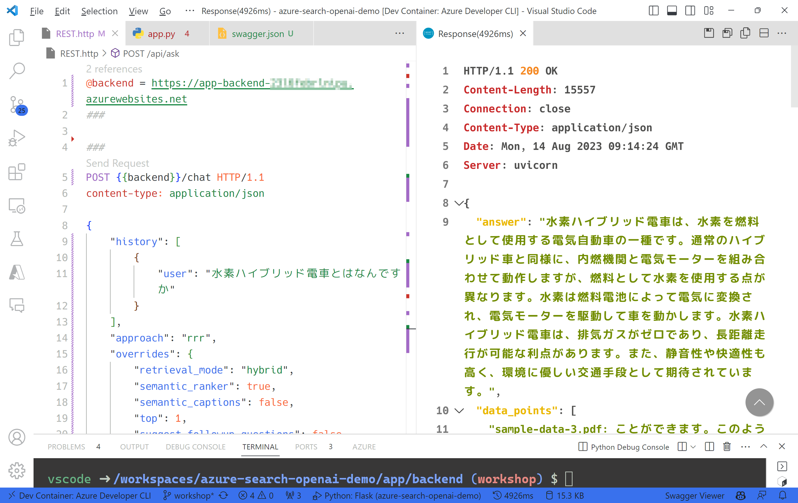


このサンプルのAPIの仕様はSwagger UIで確認できます。ブラウザで以下のURLにアクセスします。

```bash
https://app-backend-xxx.azurewebsites.net/docs/
```


たとえば、APIエンドポイントの`/ask`にリクエストを送るときのペイロードやStatus Codeが200(成功)の場合のレスポンスのデータを確認できます。

このAPIをつかってアプリケーションを実装するときはswagger.jsonを利用できます。
```
https://app-backend-xxx.azurewebsites.net/swagger.json
```

?> Swaggerは、RESTful Webサービスを記述、設計、構築、ドキュメント化するためのオープンソースのフレームワークです。Swaggerは、APIの仕様書を自動的に生成することができ、APIのエンドポイント、パラメータ、レスポンス、リクエストの形式、エラーコード、セキュリティ要件などを記述できます。Swaggerは、APIの設計とドキュメンテーションの作業を簡素化するだけでなく、開発者間の意思疎通を向上させるのに役立ちます。Swaggerは、JSONまたはYAML形式でAPIの仕様書を記述し、Swagger UIを使用して、WebブラウザでAPIの仕様書を見ることができます。


## 📖演習
今回のサンプルアプリのソースコードを確認しながら、チームでディスカッションして発表しましょう。

- Azure OpenAI Serviceは現在どのようなモデルが使えるのかを調べてみましょう。また、「責任あるAI」について業務データを利用するうえで考慮すべき点やセキュリティの原則を調べてみましょう。

- 検索クエリの作成でチャット履歴と最後の質問をもとに、GPT-3 Completion を利用して最適化されたキーワード検索クエリを生成しています。`chatreadretrieveread.py`のコードを書き換えて、振る舞いがどのように変わるかをみてみましょう。

[『ChatGPTによって描かれる未来とAI開発の変遷』日本マイクロソフト株式会社 蒲生 弘郷氏](https://www.youtube.com/watch?v=l9fpxtz22JU) 
<iframe width="560" height="315" src="https://www.youtube.com/embed/l9fpxtz22JU" title="YouTube video player" frameborder="0" allow="accelerometer; autoplay; clipboard-write; encrypted-media; gyroscope; picture-in-picture; web-share" allowfullscreen></iframe><br>


- 検索インデックスから関連文書を取得する処理はどこで行われているかを確認しましょう。

- このアプリはREST APIとして実装されています。`/ask`にリクエストを送信したときにどのような形式でデータが返るかを確認してください。また、`/chat`にリクエストをするときはどのようなデータをリクエストボディで送信する必要があるかを確認しましょう。

- AppService には組み込み認証認可の機能やGitHubとの連携機能など開発者に便利な機能が用意されています。ほかにもどのような機能があるか、どのような言語/ランタイムがサポートされているかを調べてみましょう。


?>**参考情報**<br>
[Azure OpenAI Service の製品情報](https://azure.microsoft.com/ja-jp/products/cognitive-services/openai-service) <br> 
[Azure OpenAI Service のドキュメント](https://learn.microsoft.com/ja-jp/azure/cognitive-services/openai/overview)<br>
[クイック スタート: Azure OpenAI Service で ChatGPT (プレビュー) と GPT-4 (プレビュー) の使用を開始する](https://learn.microsoft.com/ja-jp/azure/cognitive-services/openai/chatgpt-quickstart?pivots=programming-language-python&tabs=command-line)<br>
[Azure AppService Web Apps 製品情報](https://azure.microsoft.com/ja-jp/products/app-service/web)<br>
[Azure App Service のドキュメント](https://learn.microsoft.com/ja-jp/azure/app-service/)<br>
[クイックスタート: Python (Django または Flask) Web アプリを Azure App Service にデプロイする](https://learn.microsoft.com/ja-jp/azure/app-service/quickstart-python?tabs=flask%2Cwindows%2Cazure-cli%2Cvscode-deploy%2Cdeploy-instructions-azportal%2Cterminal-bash%2Cdeploy-instructions-zip-azcli)<br>


# **Part3: API統合管理基盤の作成** 
Azure Cognitive Search/Azure OpenAI Service/AppServiceを使って検索エンジンから自然言語で応答を返すAPIが作成できました。これをWebブラウザから利用できるシングルページアプリケーションやモバイルアプリケーション、ローコードツールで開発したアプリケーションなどから便利に利用できるよう、APIの統合管理を行います。

Azure API Managementは、APIを統合管理するサービスでAPIプロキシ/管理ポータル/ポリシー管理/分析などの機能を提供します。

Azure API Managementを使うと、クライアントアプリケーションとの間でリクエストとレスポンスを中継することで、トラフィック制御や認証/キャッシングなどができます。また、どのぐらいAPIが利用されているかなどの情報を分析できたり、「APIを呼び出せるのは1分間に10回まで」などのポリシーを適用して流量を制御できます。


#### このパートのゴール
* API管理の必要性を理解する
* Azure API Managementを使ってAPIの管理ができる

## 💻ハンズオン
### 1. API ManagementへのAPI登録

それでは、API Managementに作成したAPIを登録します。
Azureポータルを開き、「`openai-workshop`」リソースグループ内のAPI Managementサービスを選びます。
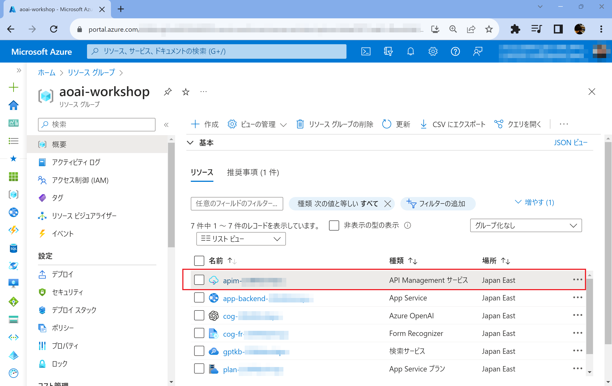

[ **API** ] - [ **+ Add API** ]をクリックします。


API Managementで管理したいAPIを登録します。今回は[`OpenAPI`]を選びます。


次に、[ **Create from OpenAPI specification** ]ダイアログが表示されるので、「 **OpenAPI specification** 」に以下の`swagger.json`ファイルを指定します。

```bash
https://app-backend-<your_name>.azurewebsites.net/swagger.json
```

この値を忘れてしまった場合は、Azureポータルを開きAppServiceのエンドポイントを確認してください。

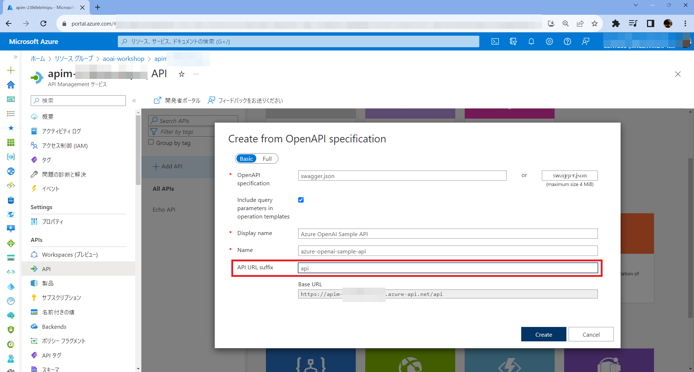

これで登録が出来ましたので、APIを確認します。たとえば「`post_ask`」をクリックすると、クライアントアプリケーションから`/ask`にリクエストがきたときに「**Inboud processing** 」を通って「 **Backend** 」にリクエストが転送されるのがわかります。このBackendでは、APIをホストしたAppServiceのエンドポイントになっているのが確認できます。またBackendからのレスポンスは「**Outbound processing** 」を通って「**Frontend** 」に応答が返ります。


ヘッダの書き換えやJWT検証、IPアドレスによる制限や流量制御などのポリシーが必要な場合は、「Add Policy」をクリックして追加します。


### 2. APIの動作確認

APIの登録ができたので、動作確認をします。

まず、API Managementを経由した場合のエンドポイントを確認します。[概要]の[ゲートウェイのURL]をコピーします。


次に、Visual Studio Codeを開き、「REST.http」をクリックします。ここで、`@apimanagament`の値に、コピーしたゲートウェイのURLを貼り付けます。


ここで「Send Request」をクリックすると、「401 Access Denied」が返ります。これはAPIに対して適切な権限がないためのエラーです。


そこで、APIのアクセスキーをリクエストに設定します。まずAzureポータルを開き、「サブスクリプション」から「Built-in all-access subscription」を選び、「キーの表示/非表示」を選びます。これで表示されたキーをコピーします。

!>これはすべてのAPIにアクセスできる強力な権限をもつキーです。本番環境で利用するときは適切なスコープ/権限を持ったキーを生成して運用してください。


Visual Studio Codeに戻り、リクエストヘッダの`Ocp-Apim-Subscription-Key`という値にコピーしたAPI Managementのキーを設定して再度リクエストを送信します。
すると、正しくAPIから応答が返ってくるのがわかります。

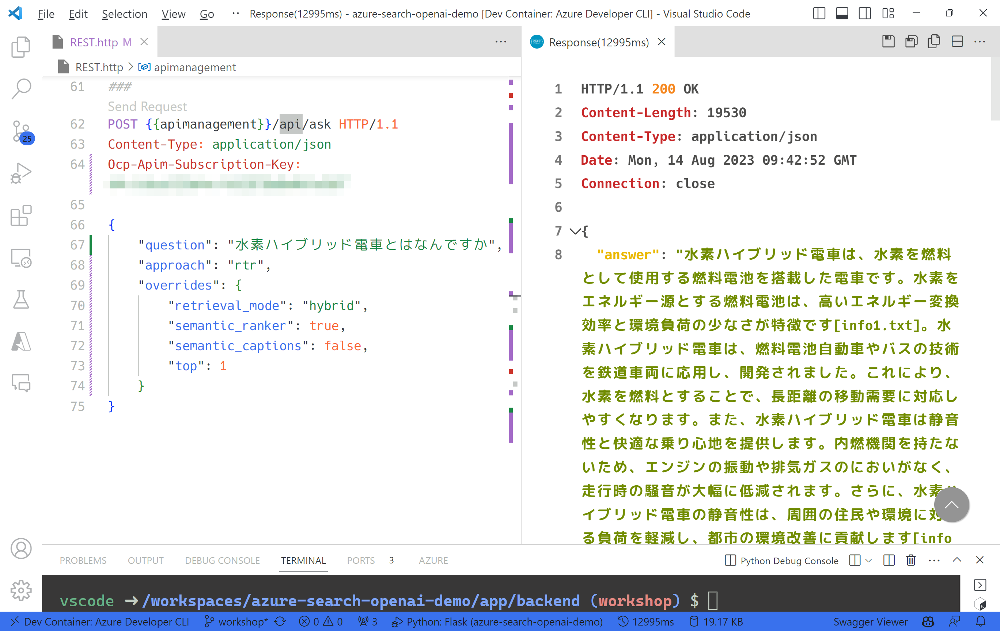


これでAPIの管理ができました。クライアントアプリケーションからのリクエストとレスポンスを一元管理できるので、アクセス制御だけでなくポリシーの設定やロギングなどもまとめて管理できます。


## 📖演習

API Managementは高機能なAPI管理サービスです。次のような課題に対してどのように実現できるかチームでディスカッションして発表しましょう。

- `/ask`エンドポイントに対して、1分間に5回以上の呼び出しができないようにポリシーを設定しましょう。

- API ManagemetでAPI使用のアクセスログを取る方法はどのような方式があるでしょうか？またどのような情報が取得できるか確認しましょう。

- API ManagementではAPIをまとめて管理する「製品」と呼ばれる機能があります。これを使うとどのようにサブスクリプション管理できるでしょうか？

- API Management ポータルは、APIのドキュメント、使用方法、ポリシーガイドラインなどの情報を提供します。開発者はポータルからAPIを探索し、利用登録を行い、APIキーを取得して利用できます。実際に試してみてどのように活用できそうかディスカッションしてみましょう。


?>**参考情報**<br>
[API Management の製品情報](https://azure.microsoft.com/ja-jp/products/api-management)<br>
[API Management のドキュメント](https://learn.microsoft.com/ja-jp/azure/api-management/)<br>
[API Management ポリシー](https://learn.microsoft.com/ja-jp/azure/api-management/api-management-howto-policies)<br>
[チュートリアル:発行された API を監視する](https://learn.microsoft.com/ja-jp/azure/api-management/api-management-howto-use-azure-monitor)<br>
[チュートリアル:開発者ポータルへのアクセスとそのカスタマイズ](https://learn.microsoft.com/ja-jp/azure/api-management/api-management-howto-developer-portal-customize)<br>
[API 認可とは](https://learn.microsoft.com/ja-jp/azure/api-management/authorizations-overview)


# **Part4: フロントエンドアプリケーションの開発/デプロイ** 

いよいよ動作するAPIができたので、このAPIのにアクセスするチャットアプリを作成します。サンプルはTypeScriptとReactを使用した静的Webアプリケーションで、ソースコードは`/app/frontend`にあります。

Azure Static Web Appsは、フロントエンドの静的Webアプリケーション(HTML/CSS、JavaScriptなど)をホストするためのサービスです。SPA(Single Page Application)や静的なウェブサイトなどを簡単に展開できます。

Azure Static Web Appsは、GitHubなどのソースコードリポジトリと連携して、自動的にビルド、デプロイ、ホスティングを行います。また、Azure FunctionsやAzure Logic AppsなどのサーバーレスバックエンドやAPI Managementと統合することも可能です。


#### このパートのゴール
* Static Web Appsを使ってフロントエンドアプリケーションを動かすことができる
* GitHubと連携したCI/CDのしくみを設定できる
* APIキーの安全な取り扱い方法を知る

## 💻ハンズオン
### 1. Frontendのデプロイ

Azureポータルを開き、「 **Web&Mobile** 」の中から「 **静的Webアプリ** 」を選びます。


プロジェクトの詳細でサブスクリプションとリソースグループ「`openai-workshop`」を選びます。


ホスティングプランを「**Standard: 汎用の運用アプリの場合**」とし、リージョンを「`East US 2`」にします。


次にデプロイを選択します。今回はGitHubを選び、ご自身のアカウントでサインインをしてください。
GitHubのリポジトリは今回のサンプルアプリをフォークしたリポジトリとし、分岐(ブランチ)を「`main`」とします。

ビルドの詳細については以下のとおり設定します。

|        項目        |    設定値     |
| ------------------ | ------------- |
| ビルドのプリセット | React         |
| アプリの場所       | /app/frontend |
| API の場所         | api           |
| 出力先             | build         |


Azure Static WebApp ではビルドとデプロイに必要となるGitHub Actionsのワークフローファイルを自動で作成します。「**プレビューワークフロー**」を確認して内容を確認します。


設定項目に問題が無ければ[**作成**]をクリックします。


ここで、[ **概要** ]の[ **デプロイ履歴** ]-[ **GitHubアクションの実行** ]をクリックするとビルドとデプロイの様子を確認できます。


これでReactアプリケーションがAzure上にデプロイされました。ただし、このアプリケーションはAPI Managementで管理したAPIを呼び出してチャットを行います。その際、APIキーなどをクライアント側のアプリケーションで保持するとキー情報の漏洩につながりますので、サーバサイドでプロキシさせることが望ましいでしょう。

Static Web AppsにはバックエンドAPIと連携する便利な機能が提供されているのでそれを利用します。
AzureポータルでStatic Web Apps「`frontend`」を選び「 **API** 」をクリックします。


ここで「リンク」をクリックするとバックエンドとして登録したいサービスを選べますので、以下を設定します。

|            項目            |           設定値           |
| -------------------------- | -------------------------- |
| バックエンドリソースの種類 | API Management             |
| サブスクリプション         | ご自身のサブスクリプション |
| リソース名                 | API Managementの名前       |


リンクが完了すると、次の画面になりますので「バックエンドリソース名」をクリックします。


連携したAPI Managementの画面に遷移します。次にStatic Web AppsからどのAPIを使いたいかを設定します。

[**製品** ]を選び「**Generated for Static Web Apps resource with default hostname: xxx** 」をダブルクリックします。


これはStatic Web AppsがAPI Managementを登録したときに自動で生成した製品グループで、デフォルトではどのAPIも利用できないようになっていますが、ここに今回作成したAPIを追加します。


[**API**]を選び、[**+ 追加**]をクリックします。


Static Web Appsでホストしたfrontendから利用したいAPIを選べますので、ここでは[ **Enterprise search API using Azure OpenAI Service** ]を選択します。


これで準備が完了しました。


AzureポータルからfrontendのURLを調べブラウザでアクセスします。


チャット画面が表示されるので質問事項を入力してエンターキーを押します。


すると、Azure OpenAI Service/Azure Cognitive Searchが検索結果を表示します。またその回答をつくる根拠となったドキュメント名も表示されているのがわかります。


チャットの **💡** アイコンをクリックすると、回答に使用されたプロンプトの内容(検索クエリ/ドキュメント検索/過去のチャット履歴)を確認できます。


チャットの **📝** アイコンをクリックすると、回答に使用されたAzure Cognitive Search の検索結果を確認できます。


## 📖演習
今回の演習ではフロントエンドをSPAで作成しましたが、モバイルアプリケーションやPowerAppsを利用したローコード開発で利用するにはどのようにすればよいか、チームでディスカッションして発表してください。

また余力がある人は、実際にアプリケーションを開発して動作確認をしてみてください。


# 🗑Azureリソースの削除
本ワークショップで使用したAzureリソースは **「openai-workshop」** にあります。演習が終わった方は忘れずにリソースグループを削除してください。


おつかれさまでした☕
